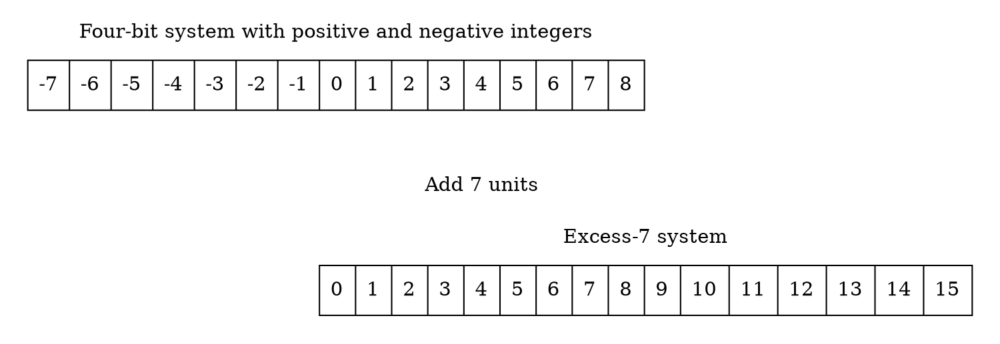

# Storing Numbers

For the decimal point, computers use two different representations:

- **Fixed-point** is used to store a number as an *integer*—without a fractional part.
- **Floating-point** is used to store a number as a *real*—with a fractional part.

## Integers

**Fixed-point** representation is used to store an integer. In this representation the decimal point is assumed but not stored.

### Unsigned Representation

An unsigned integer is an integer that can never be negative and can take only 0 or positive values. Its range is between $0$ and $\infty$ (positive infinity).

However, since no computer can possibly represent all the integers in this range, most computers define a constant
called the *maximum unsigned integer*, which has the value of $(2^n - 1)$ where $n$ is the number of bits allocated to represent an unsigned integer.

***Storing Unsigned Integers***

<div class="stepper">

An input device stores an unsigned integer using the following steps:

- The integer is changed to binary.
- <div>

    - If the number of bits is less than n, 0s are added to the left of the binary integer so that there is a total of n bits.
    - If the number of bits is greater than n, the integer cannot be stored. A condition referred to as *overflow* will occur, which we discuss later.

  </div>

</div>

<div class="alert-example">

Store 7 in an 8-bit memory location using unsigned representation.

```text
Change 7 to binary          →             1 1 1
Add five bits at the left   →   0 0 0 0 0 1 1 1
```

</div>

***Retrieving Unsigned Integers***

An output device retrieves a bit string from memory as a bit pattern and converts it to an unsigned decimal integer.

Using the procedure shown in [2-2][].

[2-2]: /notes/computer-science/計算機概論/ch02/2-2?id=any-base-to-decimal

***Overflow***

Due to size limitations—the allocated number of bits—the range of integers that can be represented is limited. In an $n$-bit memory location we can only store an unsigned integer between $0$ and $2^n - 1$.

<div class="alert-example">

If we try to store an integer that is larger than $2^4 - 1 = 15$ in a memory location that can only hold *four bits*.

This situation, called **overflow**, happens when, for example, we have stored the integer $11$ in a memory location and then try to add $9$ to the integer.

- The minimum number of bits we need to represent the decimal $20$ is *five bits*.
- In other words, $20 = (10100)_2$, so the computer <mark>drops the leftmost bit and keeps the rightmost four bits</mark> $(0100)_2 = 4$.

</div>

### Sign-And-Magnitude Representation

<div class="alert-example">

【台聯大】【112】【計算機概論】【20】

$Q:$ 假設 $A$ 與 $B$ 都是以符號與值 (Sign-and-magnitude) 8 個 bits 的格式來儲存。那麼 $A - B$ 為何？

$$ A = (0\ 0010001)_2 \quad B = (1\ 0010110)_2 $$

---

$Sol:$

8 位元的格式可以表達 $-(2^{8-1} - 1) = -127$ 至 $+(2^{8-1} - 1) = +127$ 之間的整數。

$$ A - B = 17 - (-22) = 39 = (0\ 0100111)_2$$

</div>

Although the **sign-and-magnitude representation** format is not commonly used to store integers, this format is used to store part of a real number in a computer, as described in the next section.

In this method, the available range for unsigned integers ($0$ to $2^n - 1$) is <mark>divided into two equal subranges</mark>.

- The first half represents positive integers.
- The second half, negative integers.

<div class="alert-example">

$$ n = 3 $$

```text
000 001 010 011 | 100 101 110 111
  0   1   2   3 |  -0  -1  -2  -3
```

- Note that we have two 0s: *positive zero* $(000)$ and *negative zero* $(100)$.
- In an 3-bit allocation, we can only use 2 bits to represent the absolute value of the number (number without the sign).

</div>

***Range***

Therefore, the maximum positive value is one half the unsigned value. The range of numbers that can be stored in an $n$-bit location is $-(2^{n-1} - 1)$ to $+(2^{n-1} - 1)$.

***The Sign***

In an $n$-bit allocation, the *leftmost* bit is dedicated to store the sign ($0$ for positive, $1$ for negative).

<div class="alert-example">

Store $+28$ in an 8-bit memory location using sign-and-magnitude representation.

```text
Change 28 to 7-bit binary     0 0 1 1 1 0 0
Add the sign and store      0 0 0 1 1 1 0 0
```

</div>

<div class="alert-example">

Store $-28$ in an 8-bit memory location using sign-and-magnitude representation.

```text
Change 28 to 7-bit binary     0 0 1 1 1 0 0
Add the sign and store      1 0 0 1 1 1 0 0
```

</div>

<div class="alert-example">

Retrieve the integer that is stored as $(10100001)_2$ in sign-and-magnitude representation.

- Since the leftmost bit is 1, the sign is negative.
- The rest of the bits $(0100001)_2$ are changed to decimal as $33$.
- After adding the sign, the integer is $-33$.

</div>

***Overflow***

Like unsigned integers, signed integers are also subjected to overflow. However, in this case, we may have both *positive* and *negative overflow*.

<div class="alert-example">


</div>

?> See: Appendix I - Addition and Subtraction for Sign-and-Magnitude Integers

### One's Complement

The operation can be applied to any integer, positive or negative. This operation simply *reverses* (flips) each bit.

<div class="alert-example">

The following shows how we take the one's complement of the integer $(00110110)_2$:

```text
Original pattern                              0 0 1 1 0 1 1 0
After applying one's complement operation     1 1 0 0 1 0 0 1
```

</div>

### Two's Complement Representation

<div class="alert-note">

<div class="stepper">

Take the two's complement of an integer is:

- Take the one's complement.
- Add 1 to the result (see Chapter 4 for binary addition).

</div>

</div>

<div class="alert-attention">

有兩個數字的二補數等於本身：

- 0 (忽略溢位)
- 最小負數

以 8 位元為例，最小負數為 $-128 = (10,000,000)_2$

</div>

***Storing an Integer in Two’s Complement Format***

<div class="stepper">

To store an integer in two's complement representation, the computer follows the steps below:

- The absolute value of the integer is changed to an n-bit binary.
- <div>

    - If the integer is positive or zero, it is stored as it is.
    - If it is negative, the computer takes the two's complement of the integer and then stores it.

  </div>

</div>

<div class="alert-example">

Store the integer $28$ in an 8-bit memory location using two's complement representation.

```text
Change 28 to 8-bit binary         0 0 0 1 1 1 0 0
```

</div>

<div class="alert-example">

Store the integer $-28$ in an 8-bit memory location using two's complement representation.

```text
Change 28 to 8-bit binary         0 0 0 1 1 1 0 0
Apply two’s complement operation  1 1 1 0 0 1 0 0
```

</div>

***Retrieving an Integer in Two’s Complement Format***

<div class="stepper">

To retrieve an integer in two's complement representation, the computer follows the steps below:

- <div>

    - If the leftmost bit is 1, the computer applies the two's complement operation to the integer.
    - If the leftmost bit is 0, no operation is applied.

  </div>

- The computer changes the integer to decimal.

</div>

<div class="alert-example">

Retrieve the integer that is stored as $(00001101)_2$ in memory in two's complement format.

```text
Leftmost bit is 0. The sign is positive.    0 0 0 0 1 1 0 1
Integer changed to decimal.                              13
Sign is added.                                          +13
```

</div>

<div class="alert-example">

Retrieve the integer that is stored as $(11100110)_2$ in memory using two's complement format.

```text
Leftmost bit is 1. The sign is negative.    1 1 1 0 0 1 1 0
Apply two’s complement operation.           0 0 0 1 1 0 1 0
Integer changed to decimal.                              26
Sign is added.                                          -26
```

</div>

***Overflow***

Like other representations, integers stored in two's complement format are also subject to overflow.

<div class="alert-example">


</div>

### Comparison of the Three Systems

A 4-bit memory location ($n = 4$) can store an

- **unsigned integer** between $0$ and $15$ <mark>($0 \text{ to } 2^n - 1$)</mark>
- **two's complement** signed integers between $-8$ and $+7$ <mark>($-2^{n-1} \text{ to } 2^{n-1} - 1$)</mark>

It is very important that we store and retrieve an integer in the same format.

<div class="alert-example">

If the integer $13$ is stored in signed format, it needs to be retrieved in signed format; the same integer is retrieved as $-3$ in two's complement format.

</div>

| Contents of memory | Unsigned | Sign-and-magnitude | Two's complement |
| :----------------: | :------: | :----------------: | :--------------: |
|        0000        |    0     |         0          |        +0        |
|        0001        |    1     |         1          |        +1        |
|        0010        |    2     |         2          |        +2        |
|        0011        |    3     |         3          |        +3        |
|        0100        |    4     |         4          |        +4        |
|        0101        |    5     |         5          |        +5        |
|        0110        |    6     |         6          |        +6        |
|        0111        |    7     |         7          |        +7        |
|        1000        |    8     |         −0         |        −8        |
|        1001        |    9     |         −1         |        −7        |
|        1010        |    10    |         −2         |        −6        |
|        1011        |    11    |         −3         |        −5        |
|        1100        |    12    |         −4         |        −4        |
|        1101        |    13    |         −5         |        −3        |
|        1110        |    14    |         −6         |        −2        |
|        1111        |    15    |         −7         |        −1        |

<div class="alert-example">

【台聯大】【107】【計算機概論】【6】

$Q:$ 哪些計算結果會使得 8-bit 的二補數格式發生溢位？

---

$Sol:$

8-bit 的二補數格式可以表達 $-2^{7} \text{ to } (2^{7} - 1)$ 也就是 $-128 \text{ to } 127$。

</div>

## Reals

### Floating-Point Representation

The solution for maintaining accuracy or precision is to use **floating-point representation**. This representation allows the decimal point to float: we can have different numbers of digits to the left or right of the decimal point.

In floating-point representation, either decimal or binary, a number is made up of three sections:

- Sign  
- Shifter  
- Fixed-point number

Floating-point representation is used in science to represent very small or very large decimal numbers.

<div class="alert-example">

In this representation, which is called **scientific notation**, the fixed-point section has only one digit to the left of the decimal point and the shifter is the power of 10.

$$
\begin{align}
& + & 7.425 & \times 10^{21} \\
& - & 2.32  & \times 10^{-14}
\end{align}
$$

</div>

### Normalization

To make the fixed part of the representation uniform, both the scientific method (for the decimal system) and the floating-point method (for the binary system) <mark>use only one nonzero digit on the left of the decimal point.</mark> This is called **normalization**.

```text
Decimal  ± d.xxxxxxxxxxxxxx    Note: d is 1 to 9 and each x is 0 to 9
Binary   ± 1.yyyyyyyyyyyyyy    Note: each y is 0 or 1
```

### Sign, Exponent, and Mantissa

After a binary number is normalized, only three pieces of information about the number are stored:

***Sign***

The sign of the number can be stored using 1 bit (0 or 1).

***Exponent***

The exponent (power of 2) defines <mark>the shifting of the decimal point.</mark>

- Note that the power can be negative or positive.
- The **Excess representation** (discussed later) is the method used to store the exponent.

***Mantissa***

The **mantissa** is the binary integer to the right of the decimal point.

- It defines the precision of the number. The mantissa is stored in fixed-point notation.
- If we think of the mantissa and the sign together, we can say this combination is stored as an integer in sign-and-magnitude format.

<div class="alert-example">

$+(1000111.0101)_2$ becomes:

| Sign | Exponent |     |       Mantissa |
| :--: | :------: | --- | -------------: |
|  +   |  $2^6$   | ×   | *1*.0001110101 |
| *+*  |   *6*    |     |   *0001110101* |

</div>

### The Excess System

- The *mantissa* can be stored as an *unsigned* integer.
- The *exponent*, the power that shows how many bits the decimal point should be moved to the left or right, is a *signed* number. Although this could have been stored using two's complement representation, a new representation, called the Excess system, is used instead.

In the **Excess system**, <mark>both positive and negative integers are stored as unsigned integers.</mark>

- To represent a positive or negative integer, a positive integer (called a **bias**) is added to each number to shift them uniformly to the nonnegative side.
- The value of this bias is $2^{m-1} - 1$, where $m$ is the size of the memory location to store the exponent.

<div class="alert-example">

We can express sixteen integers in a number system with 4-bit allocation.

- Using one location for 0 and splitting the other fifteen (not quite equally) we can express integers in the range of -7 to 8.
- By adding seven units to each integer in this range, we can uniformly translate all integers to the right and make all of them positive without changing the relative position of the integers with respect to each other, as shown in the figure.
- The new system is referred to as *Excess-7*, or biased representation with biasing value of 7.



The advantage of this new representation compared to that before the translation is that <mark>all integers in the Excess system are positive, so we don't need to be concerned about the sign when we are comparing or doing operations on the integers.</mark> For 4-bit allocation, the bias is $2^{4-1} - 1 = 7$, as we expected.

</div>

### IEEE Standards

The Institute of Electrical and Electronics Engineers (IEEE) has defined several standards for storing floating-point numbers. We discuss the two most common ones here,

- <mark>**Single precision** (Excess-*127*)</mark>
- **Double precision** (Excess-*1023*)

| Parameter                             | Single Precision | Double Precision |
| ------------------------------------- | :--------------: | :--------------: |
| Memory location size (number of bits) |        32        |        64        |
| *S*ign size (number of bits)          |        1         |        1         |
| *E*xponent size (number of bits)      |       *8*        |        11        |
| *M*antissa size (number of bits)      |       *23*       |        52        |
| Bias (integer)                        |      *127*       |       1023       |

<div class="alert-example">

【台聯大】【108】【計算機概論】【14】

$Q:$ What is the first 5 bits of the mantissa part of 3.125 in the IEEE-754 single precision floating point presentation?

---

$Sol:$

$$
\begin{gather}
3.125 = (11.001)_2 = (1.1001) \times 2^1 \\\\
S = 0 \\\\
E = 1 + 127 = 128 = (10000000)_2 \\\\
M = 1001 \xrightarrow{\mbox{5 bits}} 10010
\end{gather}
$$

</div>

<div class="alert-example">

【台聯大】【107】【計算機概論】【3】

$Q:$ Which of the following is the number representation of IEEE-754 single precision floating-point format $(C1890000)_{16}$ ?

---

$Sol:$

轉換十六進位成二進位 (為了方便辨別，用逗號隔開每個十六進位數值)，並使用底線畫出 $S$, $E$ 與 $M$ 的部分

$$
\dfrac{1}{S}\ \dfrac{100,\ 0001,\ 1}{E}\ \dfrac{000,\ 1001,\ 0000,\ \cdots}{M}
$$
單精度使用 Excess-127，因此
$$
E = (10000011)_2 - 127 = 4
$$

最後轉換為十進位的數值

$$
\begin{gather}
S = 1 \text{ 符號為負號, } E = 4 \text{, 去除 } M \text{ 多餘的零後} \\\\
\rightarrow \quad -(1.\underline{0001001}_M)_2 \times 2^{4} = -17.125
\end{gather}
$$

</div>

***Storage of IEEE Standard Floating-Point Numbers***

<div class="stepper">

- <div>

    Store the sign in $S$ (0 or 1).

  </div>

- Change the number to binary.
- Normalize.
- <div>

    Find the values of $E$ and $M$.

  </div>

- <div>

    Concatenate $S$, $E$, and $M$.

  </div>

</div>

<div class="alert-example">

Show the Excess-127 (single precision) representation of the decimal number $5.75$.

1. The sign is positive, so $S = 0$.
2. Decimal to binary transformation: $5.75 = (101.11)_2 \ $.
3. Normalization: $(101.11)_2 = (1.0111)_2 \times 2^2$.
4. $E = 2 + 127 = 129 = (10000001)_2$, $M = 0111$. We need to add 19 zeros at the right of $M$ to make it 23 bits.
5. The presentation is shown below:

|  S  |    E     |            M            |
| :-: | :------: | :---------------------: |
|  0  | 10000001 | 01110000000000000000000 |

The number is stored in the computer as 01000000101110000000000000000000.

</div>

***Retrieving Numbers Stored in IEEE Standard Floating-Point Format***

<div class="stepper">

A number stored in one of the IEEE floating-point formats can be retrieved using the following method:

- <div>

    Find the value of $S$, $E$, and $M$.

  </div>

- <div>

    If $S = 0$, set the sign to positive, otherwise, set the sign to negative.

  </div>

- <div>

    Find the shifter $(E - 127)$.

  </div>

- Denormalize the mantissa.
- Change the denormalized number to binary to find the absolute value.
- Add the sign.

</div>

<div class="alert-example">

The bit pattern $(11001010000000000111000100001111)_2$ is stored in memory in Excess-127 format. Show what is the value of the number in decimal notation.

1. The first bit represents $S$, the next eight bits, $E$ and the remaining 23 bits, $M$:

    |  S  |    E     |            M            |
    | :-: | :------: | :---------------------: |
    |  1  | 10010100 | 00000000111000100001111 |

2. The sign is negative.
3. The shifter $= E - 127 = (10010100)_2 - 127 = 148 - 127 = 21$.
4. Denormalization gives us $(1.00000000111000100001111)_2 \times 2^{21}$.
5. The binary number is $(1000000001110001000011.11)_2$.
6. The absolute value is $2,104,378.75$.
7. The number is $-2,104,378.75$.

</div>

***Overflow and Underflow***

This representation cannot store numbers with very small or very large absolute values.

- An attempt to store numbers with very small absolute values results in an **underflow** condition
- An attempt to store numbers with very large absolute values results to an **overflow** condition

The ranges of floating-point representations using 32-bit memory locations (*Excess-127*).

```text
            |  Presentable  |               |  Presentable  |
  Overflow  |  (negative)   |   Underflow   |  (positive)   |  Overflow
<-----------+---------------+---------------+---------------+---------->
       –Largest        –Smallest   0   +Smallest        +Largest
```

$$
\begin{align}
–\text{Largest}:  & -(1 - 2^{-24}) \times 2^{+128} & +\text{Largest}:  & +(1 - 2^{-24}) \times 2^{+128} \\
–\text{Smallest}: & -(1 - 2^{-1} ) \times 2^{-127} & +\text{Smallest}: & +(1 - 2^{-1} ) \times 2^{-127}
\end{align}
$$

***Storing Zero***

You may have noticed that a real number with an integral part and the fractional part set to zero, that is, 0.0, cannot be stored using the steps discussed above. To handle this special case, it is agreed that in this case the sign, exponent, and the mantissa are set to 0s.

***Truncation Errors***

When a real number is stored using floating-point representation, the value of the numbered stored may not be exactly as we expect it to be.

<div class="alert-example">

Assume we need to store the number:

$$ (1111111111111111.11111111111)_2 $$

in memory using Excess_127 representation. After normalization, we have:

$$ (1.11111111111111111111111111)_2 $$

This means that the mantissa has 26 1s. This mantissa needs to be truncated to 23 1s. In other words, what is stored in the computer is:

$$ (1.11111111111111111111111)_2 $$

which means the original number is changed to:

$$ (1111111111111111.11111111)_2 $$

with the three 1s at the right of the fractional part truncated. The difference between the original number and what is retrieved is called the **truncation error**.

</div>
