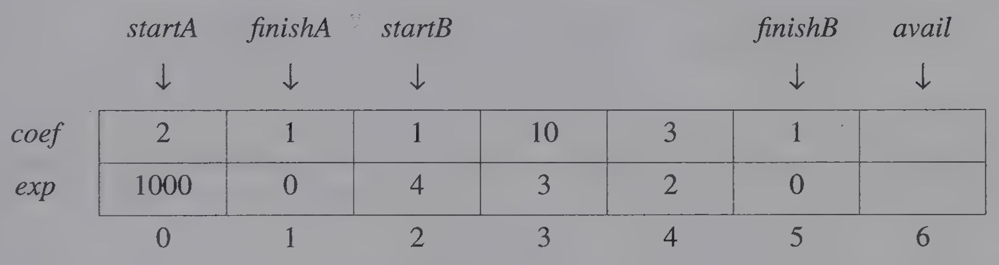

# Polynomials

Viewed from a mathematical perspective, a polynomial is a sum of terms, where each term has a form $ax^{e}$, where $x$ is the variable, $a$ is the coefficient, and $e$ is the exponent.

<div class="alert-example">

Two example polynomials are:

- $A(x) = 3x^{20} + 2x^{5} + 4$
- $B(x) = x^{4} + 10x^{3} + 3x^{2} + 1$

</div>

- The largest (or leading) exponent of a polynomial is called its **degree**.
- Coefficients that are zero are not displayed.
- The term with exponent equal to zero does not show the variable since $x$ raised to a power of zero is 1.

There are standard mathematical definitions for the sum and product of polynomials. Assume that we have two polynomials, $A(x) = \sum a_i x^i$ and $B(x) = \sum b_i x^i$ then:

$$
\begin{gather}
A(x) + B(x) = \sum (a_i + b_i) x^i \\\\
A(x) \cdot B(x) = \sum \big(a_i x^i \cdot (\sum b_j x^j)\big)
\end{gather}
$$

## Two Polynomial Representations

***First Representation***

One way to represent polynomials in C is to use `typedef` to create the type polynomial as below:

```c
#define MAX_DEGREE 101  // Max degree of polynomial+1

typedef struct {
    int degree;
    float coef[MAX_DEGREE];
} polynomial;
```

Now if $a$ is of type polynomial and $n < \text{MAX_DEGREE}$, the polynomial $A(x) = \sum_{i = 0}^{n} a_i x^i$ would be represented as:

$$
\begin{align}
& \text{a.degree = n} \\
& \text{a.coef[i] = } a_{n - i}\ ,\quad 0 \leq i \leq n
\end{align}
$$

In this representation, we store the coefficients in order of decreasing exponents, such that `a.coef[i]` is the coefficient of $x^{n-i}$ provided a term with exponent $n—i$ exists; otherwise, `a.coef[i] = 0`.

Although this representation leads to very simple algorithms for most of the operations, it <mark>wastes a lot of space.</mark>

- For instance, if $\text{a.degree} \ll \text{MAX_DEGREE}$, (the double “less than” should be read as “is much less than”), then we will not need most of the positions in `a.coef[MAX—DEGREE]`.
- The same argument applies if the polynomial is sparse, that is, the number of terms with nonzero coefficient is small relative to the degree of the polynomial.

***Second Representation***

To preserve space we devise an alternate representation that uses only one global array, `terms`, to store all our polynomials. The C declarations needed are:

```c
#define MAX_TERMS 100  // size of terms array

typedef struct {
    float coef;
    int expon;
} polynomial;

polynomial terms[MAX_TERMS];
int avail = 0;
```

<div class="alert-example">

Consider the two polynomials $A(x) = 2x^{1000} + 1$ and $B(x) = x^4 + 10x^3 + 3x^2 +1$.



Figure 2.3 shows how these polynomials are stored in the array `terms`.

- The index of the first term of $A$ and $B$ is given by `startA` and `startB`, respectively,
- while `finishA` and `finishB` give the index of the last term of `A` and `B`.
- The index of the next free location in the array is given by `avail`.
- For our example, `startA` = 0, `finishA` = 1, `startB` = 2, `finishB` = 5, and `avail` = 6.

</div>

This representation does not impose any limit on the number of polynomials that we can place in `terms`.

- The only stipulation is that the total number of nonzero terms must be no more than `MAX_TERMS`.

<div class="alert-note">

It is worth pointing out the difference between our specification and our representation.

- Our specification used $\text{poly}$ to refer to a polynomial.
- Our representation translated $\text{poly}$ into a $\langle \text{ start, finish } \rangle$ pair.

</div>

<div class="alert-example">

- Therefore, to use $A(x)$ we must pass in `startA` and `finishA`.
- Any polynomial $A$ that has $n$ nonzero terms has `startA` and `finishA` such that $\text{finishA} = \text{startA} + n - 1$.

</div>

***Comparison***

Before proceeding, we should evaluate our second representation. Is it any better than the representation that uses an array of coefficients for each polynomial?

- It certainly solves the problem of many zero terms since $A(x) = 2x^{1000} + 1$ uses only six units of storage: one for `startA`, one for `finishA`, two for the coefficients, and two for the exponents.
- However, when *all* the terms are nonzero, the second representation requires about *twice* as much space as the first one.

Unless we know before hand that each of our polynomials has few zero terms, our second representation is probably better.

## Polynomial Addition

We would now like to write a C function that adds two polynomials, $A$ and $B$, represented as above to obtain $D = A + B$. To produce $D(x)$,

- `padd` adds $A(x)$ and $B(x)$ term by term.
- Starting at position `avail`, `attach` places the terms of $D$ into the array, `terms`. If there is not enough space in terms to accommodate $D$, an error message is printed to the standard error device and we exit the program with an error condition.

```c
/* add A(x) and B(x) to obtain D(x) */
void padd(int startA, int finishA, int startB, int finishB, int *startD,
          int *finishD) {
    float coefficient;
    *startD = avail;

    while (startA <= finishA && startB <= finishB) {
        switch (COMPARE(terms[startA].expon, term[startB].expon)) {
            case -1:  // a expon < b expon
                attach(terms[startB].coef, terms[startB].expon);
                startB++;
                break;
            case 0:  // equal exponents
                coefficient = terms[startA].coef + terms[startB].coef;
                if (coefficient) {
                    attach(coefficient, terms[startA].expon);
                }
                startA++;
                startB++;
            case -1:  // a expon > b expon
                attach(terms[startA].coef, terms[startA].expon);
                startA++;
        }
    }

    // add in remaining terms of A(x)
    for (; startA <= finishA; startA++) {
        attach(terms[startA].coef, terms[startA].expon);
    }

    // add in remaining terms of B(x)
    for (; startB <= finishB; startB++) {
        attach(terms[startB].coef, terms[startB].expon);
    }

    *finishD = avail - 1;
}
```

```c
/* add a new term to the polynomial */
void attach(float coefficient, int exponent) {
    if (avail >= MAX_TERMS) {
        fprintf(stderr, "Too many terms in the polynomial\n");
        exit(EXIT_FAILURE);
    }
    terms[avail].coef = coefficient;
    terms[avail++].expon = exponent;
}
```

***Analysis of `padd`***

Since the number of nonzero terms in $A$ and in $B$ are the most important factors in the time complexity, we will carry out the analysis using them.

- Therefore, let $m$ and $n$ be the number of nonzero terms in $A$ and $B$, respectively.
- If $m > 0$ and $n > 0$, the `while` loop is entered.
- Each iteration of the loop requires $O(1)$ time.
- At each iteration, we increment the value of `startA` or `startB` or both.
- Since the iteration terminates when either `startA` or `startB` exceeds `finishA` or `finishB`, respectively, the number of iterations is bounded by $m + n - 1$. This worst case occurs when:

$$
A(x) = \sum_{i=0}^{n} x^{2i} \text{ and } B(x) = \sum_{i=0}^{n} x^{2i + 1}
$$

The time for the remaining two loops is bounded by $O(n + m)$ because we cannot iterate the first loop more than $m$ times and the second more than $n$ times. So, the asymptotic computing time of this algorithm is $O(n + m)$.

---

Before proceeding let us briefly consider a few of the problems with the current representation. We have seen that, as we create polynomials, we increment `avail` until it equals `MAX_TERMS`.

- When this occurs, must we quit? Given the current representation, we must unless there are some polynomials that we no longer need.
- We could write a *compaction function* that would remove the unnecessary polynomials and create a large, continuous available space at one end of the array.
- However, this requires data movement which takes time. In addition, we also must change the values of `start` and `finish` for every polynomial that is moved.

In Chapter 3, we let you experiment with some “simple” compacting routines.

## Polynomial ADT

```algorithm
\begin{algorithm}
\caption{ADT Polynomial}
\begin{algorithmic}

\state $\textbf{objects:}$
\state  $p(x) = a_1 x^{e_1} + \cdots + a_n x^{e_n}$; a set of ordered pairs of $\langle\ e_i, a_i\ \rangle$ \\
        where $a_i$ in Coefficients and $e_i$ in Exponents, $e_i$ are integers $\geq 0$ \\\\

\state $\textbf{functions:}$
\state  for all ploy, poly1, poly2 $\in$ Polynomial, \\
        $\hspace{2.65em}$ coef $\in$ Coefficients, \\
        $\hspace{2.65em}$ expon $\in$ Exponents

\state \\

\function{Zero}{}
    \return the polynomial, $p(x) = 0$
\endFunction

\state \\

\function{IsZero}{poly}
    \if{poly}
        \return FALSE
    \else
        \return TRUE
    \endIf
\endFunction

\state \\

\function{Coef}{poly, expon}
    \if{expon $\in$ poly}
        \return its coefficient
    \else
        \return zero
    \endIf
\endFunction

\state \\

\function{LeadExp}{poly}
    \return the largest exponent in poly 
\endFunction

\state \\

\function{Attach}{poly, coef, expon}
    \if{expon $\in$ poly}
        \return error
    \else
        \return the polynomial poly with the term $\langle \text{ coef, expon } \rangle$ inserted 
    \endIf
\endFunction

\state \\

\function{Remove}{poly, expon}
    \if{expon $\in$ poly}
        \return the polynomial poly with the term \\
                whose exponent is expon deleted  
    \else
        \return error
    \endIf
\endFunction

\state \\

\function{SingleMult}{poly, coef, expon}
    \return the polynomial $\text{poly} \cdot \text{coef} \cdot x^\text{expon}$  
\endFunction

\state \\

\function{Add}{poly1, poly2}
    \return $\text{poly1} + \text{poly2}$  
\endFunction

\state \\

\function{Mult}{poly1, poly2}
    \return $\text{poly1} \cdot \text{poly2}$  
\endFunction

\end{algorithmic}
\end{algorithm}
```
