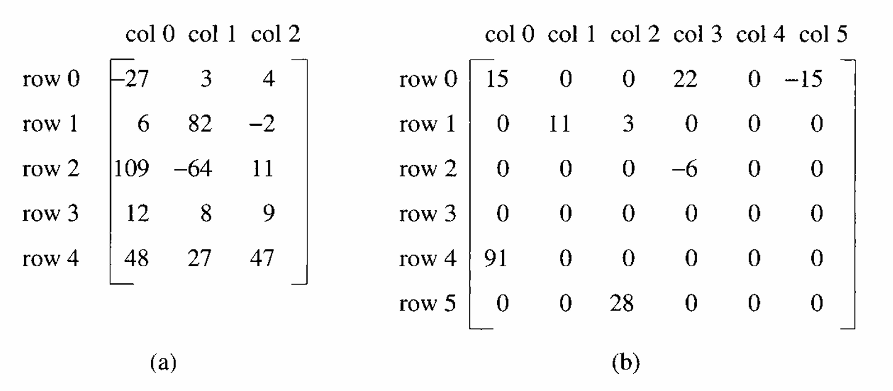
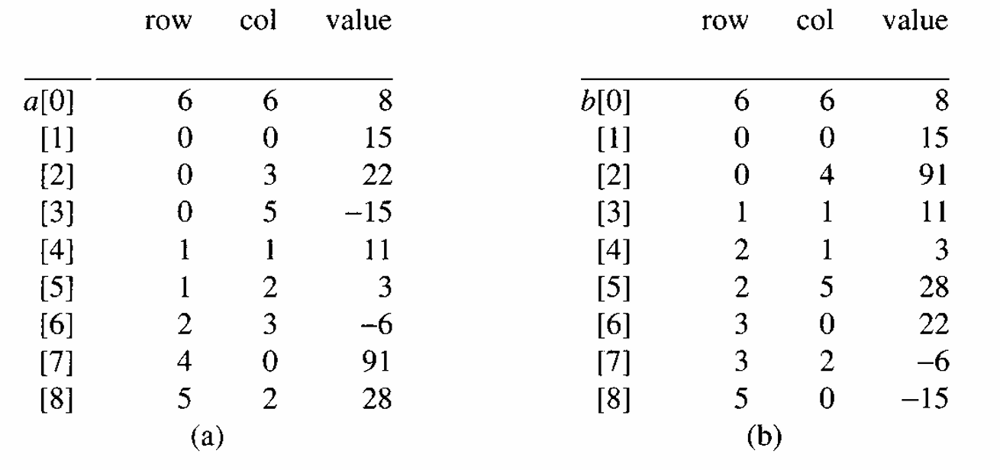

# Sparse Matrices

We now turn our attention to a mathematical object that is used to solve many problems in the natural sciences, the matrix. As computer scientists, our interest centers not only on the specification of an appropriate ADT, but also on finding representations that let us efficiently perform the operations described in the specification.

In mathematics, a matrix contains $m$ rows and $n$ columns of elements as illustrated in Figure 2.4.

<div class="alert-example">



In this figure, the elements are numbers.

- The first matrix has five rows and three columns
- The second has six rows and six columns.

</div>

In general,

- we write $m \times n$ (read “$m$ by $n$”) to designate a matrix with $m$ rows and $n$ columns.
- The total number of elements in such a matrix is $mn$.
- If $m$ equals $n$, the matrix is square.

***Representation***

When a matrix is represented as a two-dimensional array defined as `a[MAX_ROWS][MAX_COLS]`, we can locate quickly any element by writing `a[i][j]`, where `i` is the row index and `j` is the column index. However, there are some problems with this representation.

<div class="alert-example">

If you look at the matrix of Figure 2.4(b), you notice that it contains many zero entries. Only 8 of 36 elements are nonzero, and that certainly is sparse. We call this a **sparse matrix**.

</div>

Although it is difficult to determine exactly whether a matrix is sparse or not, intuitively we can recognize a sparse matrix when we see one. When a sparse matrix is represented as a two-dimensional array, we *waste space*.

<div class="alert-example">

Consider the space requirements necessary to store a $1000 \times 1000$ matrix that has only $2000$ non-zero elements. The corresponding two-dimensional array requires space for $1,000,000$ elements!

We can do much better by using a representation in which only the nonzero elements are stored.

</div>

## Matrix ADT

Before developing a particular representation, we first must consider the operations that we want to perform on these matrices. A minimal set of operations includes

- matrix creation
- addition
- multiplication
- transpose

```algorithm
\begin{algorithm}
\caption{ADT SparseMatrix}
\begin{algorithmic}

\state $\textbf{objects:}$
\state  a set of triples, $\langle \text{ row, column, value } \rangle$, \\
        where row and column are integers and from a unique combination, \\
        and value comes from the set item. \\\\

\state $\textbf{functions:}$
\state  for all a, b $\in$ SparseMatrix, \\
        $\hspace{2.65em}$ i, j, maxCol, maxRow $\in$ index

\state \\

\function{Create}{maxRow, maxCol}
    \return a SparseMatrix that can hold up to \\
            maxItems = maxRow $\times$ maxCol and \\
            whose maximum row size is maxRow and \\
            whose maximum column size is maxCol. 
\endFunction

\state \\

\function{Transpose}{a}
    \return the matrix produced by \\
            interchanging the row and column value of every triple.
\endFunction

\state \\

\function{Add}{a, b}
    \if{the dimensions of a and b are the same}
        \return the matrix by adding corresponding items, \\
                namely those with identical row and column values.
    \else
        \return error
    \endIf
\endFunction

\state \\

\function{Multiply}{a, b}
    \if{number of columns in $a$ equals number of rows in $b$ }
        \return the matrix $d$ produced by multiplying $a$ by $b$ \\
                according to the formula: $d[i][j] = \sum (a[i][k] \cdot b[k][j])$ \\
                where $d(i, j)$ is the $(i, j)$th element.
    \else
        \return error
    \endIf
\endFunction

\end{algorithmic}
\end{algorithm}
```

## Sparse Matrix Representation

Before implementing any of the ADT operations, we must establish the representation of the sparse matrix.

- By examining Figure 2.4, we know that we can characterize uniquely any element within a matrix by using the triple $\langle \text{ row, col, value } \rangle$.
- This means that we can use an array of triples to represent a sparse matrix.

```c
#define MAX_TERMS 101  // maximum number of terms + 1

typedef struct {
    int col;
    int row;
    int value;
} term;

term a[MAX_TERMS];
```

---

Since we want our `transpose` operation to work efficiently,

- we should organize the triples so that the row indices are in ascending order.
- We can go one step further by also requiring that all the triples for any row be stored so that the column indices are in ascending order.

---

In addition, to ensure that the operations terminate, we must know the number of rows and columns, and the number of nonzero elements in the matrix.

<div class="alert-example">

Since `MAX_TERMS` is greater than eight, these statements can be used to represent the second sparse matrix from Figure 2.4.




Figure 2.5(a) shows how this matrix is represented in the array `a`. Thus,

- `a[0].row` contains the number of rows;
- `a[0].col` contains the number of columns; and
- `a[0].value` contains the total number of nonzero entries.

Positions 1 through 8 store the triples representing the nonzero entries.

- The row index is in the field `row`;
- the column index is in the field `col`; and
- the value is in the field `value`.

The triples are ordered by row and within rows by columns.

</div>

## Transposing a Matrix

Figure 2.5(b) shows the transpose of the sample matrix.


To transpose a matrix we must interchange the rows and columns.

- This means that each element `a[i][j]` in the original matrix becomes element `b[j][i]` in the transpose matrix.
- <div class="alert-warning">

    Since we have organized the original matrix by rows, we might think that the following is a good algorithm for transposing a matrix:

    ```algorithm
    \begin{algorithm}
    \caption{Transposing a Matrix}
    \begin{algorithmic}

    \for{$\textbf{each}$ row i}
        \state take element $\langle \text{ i, j, value } \rangle$ and 
        \state store it as element $\langle \text{ j, i, value } \rangle$ of the transpose;
    \endFor

    \end{algorithmic}
    \end{algorithm}
    ```

    Unfortunately, if we process the original matrix by the row indices we will not know exactly where to place element $\langle \text{ j, i, value } \rangle$ in the transpose matrix until we have processed all the elements that precede it.

  <div class="alert-example">

  In Figure 2.5, we have:

    - (0, 0, 15) which becomes (0, 0, 15)
    - (0, 3, 22) which becomes (3, 0, 22)
    - (0, 5, -15) which becomes (5, 0, —15)

  If we place these triples consecutively in the transpose matrix, then, as we insert new triples, we <mark>must move elements to maintain the correct order.</mark>

  </div>

</div>

<mark>We can avoid this data movement by using the *column* indices to determine the placement of elements in the transpose matrix.</mark> This suggests the following algorithm:

```algorithm
\begin{algorithm}
\caption{Transposing a Matrix}
\begin{algorithmic}

\forAll{elements in column j }
    \state place element $\langle \text{ i, j, value } \rangle$ in element $\langle \text{ j, i, value } \rangle$
\endFor

\end{algorithmic}
\end{algorithm}
```

The algorithm indicates that we should

- find all the elements in column 0 and store them in row 0 of the transpose matrix,
- find all the elements in column 1 and store them in row 1, etc.

Since the original matrix ordered the rows, the columns within each row of the transpose matrix will be arranged in ascending order as well. This algorithm is incorporated in `transpose`. The first array, `a`, is the original array, while the second array, `b`, holds the transpose.

```c
// b is set to the transpose of a
void transpose(term a[], term b[]) {
    int n, currentb;
    n = a[0].value;       // total number of elements
    b[0].row = a[0].col;  // rows in b = columns in a
    b[0].col = a[0].row;  // columns in b = rows in a
    b[0].value = n;

    // non zero matrix
    if (n > 0) {
        currentb = 1;

        // transpose by the columns in a
        for (int i = 0; i < a[0].col; i++) {
            for (int j = 1; j <= n; j++) {
                // 遍歷所有元素，挑選欄號為 i 的元素
                if (a[j].col == i) {
                    // element is in current column, add it to b
                    b[currentb].row = a[j].col;
                    b[currentb].col = a[j].row;
                    b[currentb].value = a[j].value;
                    currentb++;
                }
            }
        }
    }
}
```

It is not too difficult to see that the function works correctly.

- The variable, `currentb`, holds the position in `b` that will contain the next transposed term.
- We generate the terms in `b` by rows, but since the rows in `b` correspond to the columns in `a`, we collect the nonzero terms for row `i` of `b` by collecting the nonzero terms from column `i` of `a`.

***Analysis of `transpose`***

Determining the computing time of this algorithm is easy since the nested for loops are the decisive factor.

- The remaining statements (two if statements and several assignment statements) require only constant time.
- We can see that the outer for loop is iterated `a[0].col` times, where `a[0].col` holds the number of columns in the original matrix.
- In addition, one iteration of the inner for loop requires `a[0].value` time, where `a[0].value` holds the number of elements in the original matrix.
- Therefore, the total time for the nested for loops is $\text{columns} \cdot \text{elements}$. Hence, the asymptotic time complexity is $O(\text{columns} \cdot \text{elements})$.

***Disadvantage***

We now have a matrix transpose algorithm with a computing time of $O(\text{columns} \cdot \text{elements})$. This time is a little disturbing since we know that if we represented our matrices as two-dimensional arrays of size $\text{rows} \times \text{columns}$, we could obtain the transpose in $O(\text{rows} \cdot \text{columns})$ time. The algorithm to accomplish this has the simple form:

```c
// 不節省空間，直接使用二維陣列來表示稀疏矩陣
// 其時間複雜度為 O(rows × columns)
for (int j = 0; j < columns; j++) {
    for (int i = 0; i < rows; i++) {
        b[j][i] = a[i][j];
    }
}
```

The $O(\text{columns} \cdot \text{elements})$ time for our transpose function <mark>becomes $O(\text{columns}^2 \cdot \text{rows})$ when the number of elements is of the order $\text{columns} \cdot \text{rows}$.</mark>

Perhaps, to conserve space, we have traded away too much time.

### Fast Transpose

Actually, we can create a much better algorithm by using a little more storage. In fact, we can transpose a matrix represented as a sequence of triples in $O(\text{columns} + \text{elements})$ time.

This algorithm, `fastTranspose`, proceeds by

- first determining the number of elements in each column of the original matrix. This gives us the number of elements in each row of the transpose matrix.
- From this information, we can determine the starting position of each row in the transpose matrix.
- We now can move the elements in the original matrix one by one into their correct position in the transpose matrix.
- We assume that the number of columns in the original matrix never exceeds `MAX_COL`.

```c
// 矩陣先依照 row 再依照 column 來排序儲存，轉置後也需要符合這個模式

// the transpose of a is placed in b
void fastTranspose(term a[], term b[]) {
    int rowTerms[MAX_COL];      // 記錄 a 的每一欄有多少非零元素
                                // 同時也為 b 的每一行有多少非零元素
    int startingPos[MAX_COL];   // 紀錄轉置後每一個行（原本的欄）在 b 中
                                // 開始存放元素的位置

    int numCols = a[0].col;     // a 矩陣的欄數 (轉置後成為 b 的行數)
    int numTerms = a[0].value;  // 非零元素個數

    b[0].row = numCols;
    b[0].col = a[0].row;
    b[0].value = numTerms;

    // nonzero matrix
    if (numTerms > 0) {

        // 初始化 rowTerms 陣列
        for (int i = 0; i < numCols; i++) {
            rowTerms[i] = 0;
        }

        // 計算 a 矩陣中每一欄（col）有多少個非零元素
        // 這些數量會用來決定轉置後矩陣 b 中每一行的元素數量
        for (int i = 1; i <= numTerms; i++) {
            rowTerms[a[i].col]++;
        }

        startingPos[0] = 1;
        // 根據前一欄的起始位置和元素個數來推算目前欄的起始位置
        // 轉置後，a 的欄會成為 b 的行，利用此資訊做為 b 每一行的起始位置
        for (int i = 1; i < numCols; i++) {
            startingPos[i] = startingPos[i - 1] + rowTerms[i - 1];
        }

        // 依序處理 a 中的每一個非零元素，將它放到轉置後 b 的正確位置
        for (int i = 1; i <= numTerms; i++) {

            // 取得該元素在 b 陣列中的插入位置 j
            // startingPos[a[i].col] 表示「該欄（轉置後的行）的下個可插入位置」
            // 使用後再遞增，確保下一個同欄元素會往後排
            int j = startingPos[a[i].col]++;

            b[j].row = a[i].col;
            b[j].col = a[i].row;
            b[j].value = a[i].value;
        }
    }
}
```

***Analysis of `fastTranspose`***

The bodies of the loops are executed `numCols`, `numTerms`, `numCols - 1`, and `numTerms` times, respectively. Since the statements within the loops require only constant time, the computing time for the algorithm is $O(\text{columns} + \text{elements})$.

$$
\begin{align}
& O(2(\text{numCols} + \text{numTerms}) − 1) \\
=\ & O(\text{numCols} + \text{numTerms}) \\
=\ & O(\text{columns} + \text{elements})
\end{align}
$$

The time becomes $O(\text{columns} \cdot \text{rows})$ when the number of elements is of the order $\text{columns} \cdot \text{rows}$.

$$
\begin{align}
& O(\text{columns} + \text{elements}) \\
=\ & O(\text{columns} + \text{columns} \cdot \text{rows}) \\
=\ & O(\text{columns} \cdot \text{rows})
\end{align}
$$

This time equals that of the two-dimensional array representation, although `fastTranspose` has a larger constant factor. However, when the number of elements is sufficiently small compared to the maximum of $\text{columns} \cdot \text{rows}$, `fastTranspose` is much faster. Thus, in this representation we save both time and space.

This was not true of `transpose` since the number of elements is usually greater than $\text{max}\{\text{columns}, \text{rows}\}$ and $\text{columns} \cdot \text{elements}$ is always at least $\text{columns} \cdot \text{rows}$. In addition, the constant factor for `transpose` is bigger than that found in the two-dimensional array representation. However, `transpose` requires less space than `fastTranspose` since the latter function must allocate space for the `rowTerms` and `startingPos` arrays.

We can reduce this space to one array if we put the starting positions into the space used by the row terms as we calculate each starting position.

<div class="alert-example">

If we try the algorithm on the sparse matrix of Figure 2.5(a),


then after the execution of the third for loop, the values of `rowTerms` and `startingPos` are:

$$
\begin{align}
&&& [0] && [1] && [2] && [3] && [4] && [5] \\
\text{rowTerms} &= &&\ 2 &&\ 1 &&\ 2 &&\ 2 &&\ 0 &&\ 1 \\
\text{startingPos} &= &&\ 1 &&\ 3 &&\ 4 &&\ 6 &&\ 8 &&\ 8
\end{align}
$$

</div>

The number of entries in row $i$ of the transpose is contained in `rowTerms[i]`. The starting position for row $i$ of the transpose is held by `startingPos[i]`.

## Matrix Multiplication

A second operation that arises frequently is matrix multiplication, which is defined below.

**Definition**: Given $A$ and $B$ where $A$ is $m \times n$ and $B$ is $n \times p$, the product matrix $D$ has dimension $m \times p$. Its $\langle\ i, j\ \rangle$ element is:

$$
d_{ij} = \sum_{k=0}^{n-1} a_{ik} b_{kj}
$$

for $0 \leq i < m$ and $0 \leq j < p$.

The product of two sparse matrices may no longer be sparse.

<div class="alert-example">

$$
\begin{bmatrix}
1 & 0 & 0 \\
1 & 0 & 0 \\
1 & 0 & 0
\end{bmatrix}
\begin{bmatrix}
1 & 1 & 1 \\
0 & 0 & 0 \\
0 & 0 & 0
\end{bmatrix}
=
\begin{bmatrix}
1 & 1 & 1 \\
1 & 1 & 1 \\
1 & 1 & 1
\end{bmatrix}
$$

</div>

We would like to multiply two sparse matrices represented as an ordered list (Figure 2.5).

We need to compute the elements of $D$ by rows so that we can store them in their proper place without moving previously computed elements.

- To do this we pick a row of $A$ and find all elements in column $j$ of $B$ for $j = 0,\ 1,\ \cdots,\ \text{colsB} - 1$.
- Normally, we would have to scan all of $B$ to find all the elements in column $j$. However, we can avoid this by first <mark>computing the transpose of $B$. This puts all column elements in consecutive order.</mark>
- Once we have located the elements of row $i$ of $A$ and column $j$ of $B$ we just do a merge operation.

***Function `mmult`***

To obtain the product matrix $D$, `mmult` multiplies matrices $A$ and $B$ using the strategy outlined above.

- We store the matrices $A$, $B$, and $D$ in the arrays `a`, `b`, and `d`, respectively.
- To place a triple in `d` and to reset sum to 0, `mmult` uses `storeSum`.

```c
// multiply two sparse matrices
void mmult(term a[], term b[], term d[]) {
    int totalA = a[0].value, totalB = b[0].value, totalD = 0; // 非零元素數量
    int rowsA = a[0].row, colsA = a[0].col:
    int rowsB = b[0].row, colsB = b[0].col;
    int newB[MAX_TERMS][3];

    if (colsA != rowsB) {
        fprintf(stderr, "Incompatible matrices\n");
        exit(EXIT_FAILURE);
    }

    fastTranspose(b, newB);

    // 設定邊界條件，避免在迴圈中使用額外的判斷語句如 if (i > totalA) break;
    a[totalA + 1].row = rowsA;
    newB[totalB + 1].row = colsB;
    newB[totalB + 1].col = 0;   // a[i].col >= 0
                                // 所以最後只會有 case 0 與 case 1 的情況發生

    int rowBegin = 1, row = a[1].row, sum = 0;
    for (int i = 1; i <= totalA;) {
        int column = newB[1].row;
        // newB 是 b 的轉置矩陣
        // newB[j].row 表示「矩陣 b 的欄」

        for (int j = 1; j <= totalB + 1;) {
            // multiply row of a by column of b

            // a[i] 不再屬於目前處理的 row
            if (a[i].row != row) {
                // 代表目前 row 和 column 的相乘已經完成，將結果存入 d
                storeSum(d, &totalD, row, column, &sum);
                // 重新使用 a 的同一行
                i = rowBegin;
                // 去乘以 b 的下一欄
                for (; newB[j].row == column; j++)
                    ;
                column = newB[j].row;
            }
            // 同理 b 的元素不再屬於目前處理的 column
            else if (newB[j].row != column) {
                // 代表目前 row 和 column 的相乘已經完成，將結果存入 d
                storeSum(d, &totalD, row, column, &sum);
                // 重新使用 a 的同一行
                i = rowBegin;
                // 去乘以 b 的下一欄
                column = newB[j].row;
            } else {
                // 稀疏矩陣相乘：a 的某列 × b 的某欄
                // 只需要處理非零元素間的乘法
                // 也就是某列 a 元素的 col 與某欄 b 元素的 row 要相等
                //                        (轉置矩陣某列 newB 元素的 col)
                // 才可以產生非零的積，並累加至 sum
                switch (COMPARE(a[i].col, newB[j].col)) {
                    case -1:  // go to next term in a
                        i++;
                        break;
                    case 0:  // add terms, go to next term in a and b
                        sum += (a[i++].value * newB[j++].value);
                        break;
                    case 1:  // advance to next term in b
                        j++;
                }
            }
        }

        // 找到 a 中下一個不同 row 的元素，準備處理新的一行
        for (; a[i].row == row; i++)
            ;
        rowBegin = i;   // 新行的第一個非零元素
        row = a[i].row; // 更新目前處理的 row
    }

    d[0].row = rowsA;
    d[0].col = colsB;
    d[0].value = totalD;
}
```

In addition, `mmult` uses several local variables that we will describe briefly.

- The variable `row` is the row of $A$ that we are currently multiplying with the columns in $B$.
- The variable `rowBegin` is the position in `a` of the first element of the current row.
- The variable `column` is the column of $B$ that we are currently multiplying with a row in $A$.
- The variable `totalD` is the current number of elements in the product matrix $D$.
- The variables `i` and `j` are used to examine successively elements from a row of $A$ and a column of $B$.
- Finally, the variable `newB` is the sparse matrix that is the transpose of `b`.

Notice that we have introduced an additional term into both `a` (`a[totalA+1].row = rowsA;`) and `newB` (`newB[totalB+1].row = colsB;`). These dummy terms serve: as sentinels that enable us to obtain an elegant algorithm.

***Function `storeSum`***

```c
// if *sum != 0,
// then it along with its row and column position is stored as the
// *totalD+1 entry in d
void storeSum(term d[], int *totalD, int row, int column, int *sum) {
    if (*sum) {
        if (*totalD < MAX_TERMS) {
            d[++*totalD].row = row;
            d[*totalD].col = column;
            d[*totalD].value = *sum;
            *sum = 0;
        } else {
            fprintf(stderr, "Numbers of terms in product exceeds %d\n",
                    MAX_TERMS);
            exit(EXIT_FAILURE);
        }
    }
}
```

***Analysis of `mmult`***

Besides the space needed for `a`, `b`, `d`, and a few simple variables, we also need space to store the transpose matrix `newB`. We also must include the additional space required by `fastTranspose`.

- We can see that the lines before the first for loop require only $O(\text{colsB} + \text{totalB})$ time, which is the time needed to transpose `b`.
- The outer for loop is executed `totalA` times. At each iteration either `i` or `j` or both increase by 1, or `i` and `column` are reset.
- The maximum total increment in `j` over the entire loop is `totalB + 1`.

---

If $\text{termsRow}$ is the total number of terms in the current row of $A$, then

- `i` can increase at most $\text{termsRow}$ times before `i` moves to the next row of $A$. When this happens, we reset `i` to `rowBegin`, and, at the same time, advance `column` to the next column.
- Thus, this resetting takes place at most $\text{colsB}$ time, and
- the total maximum increment in `i` is $\text{colsB} \times \text{termsRow}$.
- Therefore, the maximum number of iterations of the outer for loop is $\text{colsB} + \text{colsB} \times \text{termsRow} + \text{totalB}$. ($\text{totalB}$ 是遞增 `j` 來執行 `COMPARE(a[i].col, newB[j].col)`)

The time for the inner loop during the multiplication of the current row is $O(\text{colsB} \times \text{termsRow} + \text{totalB})$, and the time to advance to the next row is $O(\text{termsRow})$. Thus, the time for one iteration of the outer for loop is $O(\text{colsB} \times \text{termsRow} + \text{totalB})$. The overall time for this loop is:

$$
\begin{align}
& O(\sum_{row}(\text{colsB} \times \text{termsRow} + \text{totalB})) \\
= & O(\text{colsB} \cdot \text{totalA} + \text{rowsA} \cdot \text{totalB})
\end{align}
$$

***Comparison***

Once again we can compare this time with the computing time required to multiply matrices using the standard array representation. The classic multiplication algorithm is:

```c
for (i = 0; i < rowsA; i++) {
    for (j = 0; j < colsB; j++) {
        sum = 0;
        for (k = 0; k < colsA; k++) {
            sum += (a[i][k] * b[k][j]);
        }
        d[i][j] = sum;
    }
}
```

This algorithm takes $O(\text{rowsA} \cdot \text{colsA} \cdot \text{colsB})$ time. Since $\text{totalA} \leq \text{colsA} \cdot \text{rowsA}$ and $\text{totalB} \leq \text{colsA} \times \text{colsB}$, the time for `mmult` is $O(\text{rowsA} \cdot \text{colsA} \cdot \text{colsB})$. ($\text{矩陣乘法：colsA = rowsB}$)

- However, its constant factor is greater than that of the classic algorithm. In the worst case, when $\text{totalA} = \text{colsA} \cdot \text{rowsA}$ or $\text{totalB} = \text{colsA} \cdot \text{colsB}$, `mmult` is slower by a constant factor.
- However, when `totalA` and `totalB` are sufficiently smaller than their maximum value, that is, A and B sparse, `mmult` outperforms the classic algorithm.

This representation of sparse matrices permits us to perform operations such as addition, transpose, and multiplication efficiently. However, there are other considerations that make this representation undesirable in certain applications.

Since the number of terms in a sparse matrix is variable, we would like to represent all our sparse matrices in *one array* as we did for polynomials. This would enable us to make efficient utilization of space. However, when this is done we run into difficulties in allocating space from the array to any individual matrix. These difficulties also occur with the polynomial representation and will become even more obvious when we study a similar representation for multiple stacks and queues.
