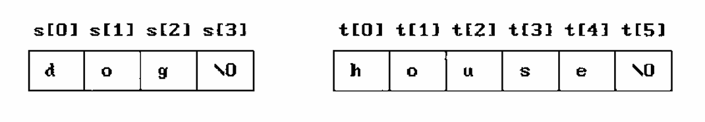
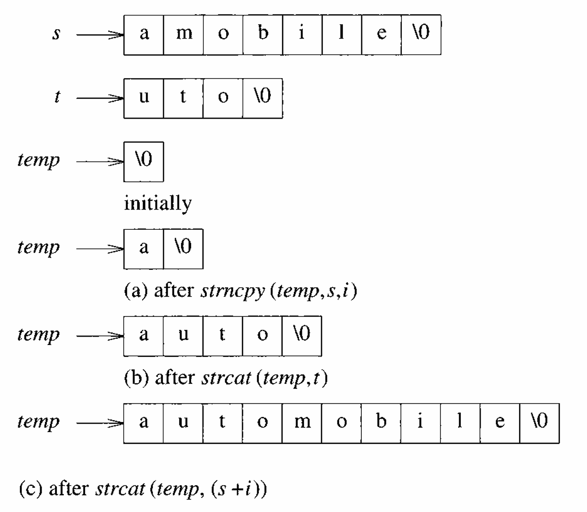
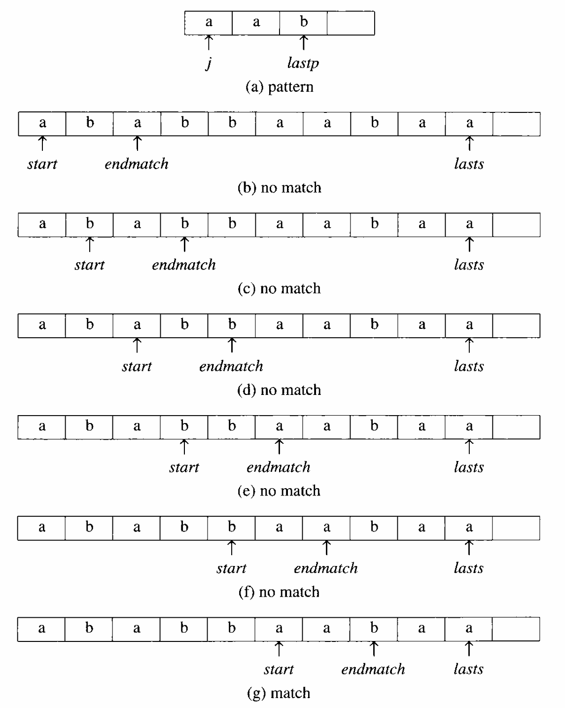

# Strings

Thus far, we have considered only ADTs whose component elements were numeric.

<div class="alert-example">

We created a sparse matrix ADT and represented it as an array of triples $\langle \text{ row, col, value } \rangle$.

</div>

In this section, we turn our attention to a data type, the string, whose component elements are characters. As an ADT, we define a string to have the form, $S = s_0, \ldots, s_{n-1}$, Where $s_i$ are characters taken from the character set of the programming language. If $n=0$, then $S$ is an empty or null string.

There are several useful operations we could specify for strings. Some of these operations are similar to those required for other ADTs:

- Creating a new empty string.
- Reading a string or printing it out.
- Appending two strings together (called concatenation).
- Copying a string.

However, there are other operations that are unique to our new ADT, including

- Comparing strings.
- Inserting a substring into a string.
- Removing a substring from a string.
- Finding a pattern in a string.

We have listed the essential operations in ADT 2.4, which contains our specification of the string ADT.

```algorithm
\begin{algorithm}
\caption{ADT String}
\begin{algorithmic}

\state $\textbf{objects:}$
\state A finite set of zero or more characters.  \\\\

\state $\textbf{functions:}$
\state  for all s, t $\in$ String, \\
        $\hspace{2.65em}$ i, j, m $\in$ non-negative integers

\state \\

\function{Null}{m}
    \return a string whose maximum length is m characters, \\
            but is initially set to NULL. We write NULL as “”.
\endFunction

\state \\

\function{Compare}{s, t}
    \if{s equals t}
        \return 0
    \elif{s precedes t}
        \return -1
    \else
        \return 1
    \endIf
\endFunction

\state \\

\function{IsNull}{s}
    \if{\call{Compare}{s, NULL}}
        \return FALSE
    \else
        \return TRUE
    \endIf
\endFunction

\state \\

\function{Length}{s}
    \if{\call{Compare}{s, NULL}}
        \return the number of characters in s 
    \else
        \return 0
    \endIf
\endFunction

\state \\

\function{Concat}{s, t}
    \if{\call{Compare}{t, NULL}}
        \return a string whose elements are those of s followed by those of t
    \else
        \return s
    \endIf
\endFunction

\state \\

\state \comment{i 是起始位置，j 是長度}
\function{Substr}{s, i, j}
    \if{(j > 0) \&\& (i + j $-$ 1) < \call{Length}{s}}
        \return the string containing the characters of s \\
                at positions $\text{i, i+1, } \ldots \text{, i + j} - \text{1}$. 
    \else
        \return NULL
    \endIf
\endFunction

\end{algorithmic}
\end{algorithm}
```

Actually there are many more operations on strings, as we shall see when we look at part of C’s string library in Figure 2.8.

## Strings in C

In C, we represent strings as character arrays terminated with the null character `\O`.

<div class="alert-example">

Suppose we had the strings:

```c
#define MAX_SIZE 100  // maximum size of string
char s[MAX_SIZE] = {"dog"};
char t[MAX_SIZE] = {"house"};
```

Figure 2.9 shows how these strings would be represented internally in memory.



Notice that we have included array bounds for the two strings.

Technically, we could have declared the arrays with the statements:

```c
char s[] = {"dog"};
char t[] = {"house"};
```

Using these declarations, the C compiler would have allocated just enough space to hold each word including the null character.

</div>

<div class="alert-example">

Now suppose we want to **concatenate** these strings together to produce the new string, `"doghouse"`. To do this we use the C function `strcat`. Two strings are joined together by `strcat(s, t)`, which stores the result in `s`.

- Although `s` has increased in length by five, we have no additional space in `s` to store the extra five characters.
- Our compiler handled this problem inelegantly: it simply overwrote the memory to fit in the extra five characters. Since we declared `t` immediately after `s`, this meant that part of the word `"house"` disappeared.

</div>

We have already seen that C provides a built-in function to perform concatenation. In addition to this function, C provides several other string functions which we access through the statement `#include <string.h>`. [string.h][]

[string.h]: https://cplusplus.com/reference/cstring/

<div class="alert-example">

Assume that we have two strings, say `string1` and `string2`, and that we want to insert `string2` into `string1` starting at the `i`th position of `string1`. We begin with the declarations:

```c
#include <string.h>

#define MAX_SIZE 100  // size of largest string

char string1[MAX_SIZE], *s = string1;
char string2[MAX_SIZE], *t = string2;
```

In addition to creating the two strings, we also have created a pointer for each string.

Now suppose that the first string contains `"amobile"` and the second contains `"uto"` (Figure 2.10).



We want to insert `"uto"` starting at position 1 of the first string, thereby producing the word `"automobile"`. We can accomplish this using only three function calls, as Figure 2.10 illustrates. Thus,

- In Figure 2.10(a), we assume that we have an empty string that is pointed to by `temp`. We use `strncpy` to copy the first `i` characters from `s` into `temp`. Since $i = 1$, this produces the string `"a"`.
- In Figure 2.10(b), we concatenate `temp` and `t` to produce the string `"auto"`.
- Finally, we append the remainder of `s` to `temp`. Since `strncat` copied the first `i` characters, the remainder of the string is at address $(s + i)$. The final result is shown in Figure 2.10(c).

</div>

<div class="alert-example">

```c
// Program 2.12

// inset string t into string s at position i
void strnins(char *s, char *t, int i) {
    char string[MAX_SIZE], *temp = string;

    if (i < 0 && i > strlen(s)) {
        fprintf(stderr, "Position is out of bounds \n");
        exit(EXIT_FAILURE);
    }

    if (!strlen(s)) {
        strcpy(s, t);
    } else if (strlen(t)) {
        strncpy(temp, s, i);
        strcat(temp, t);
        strcat(temp, (s + i));
        strcpy(s, temp);
    }
}
```

Program 2.12 inserts one string into another.

- This particular function is not normally found in `<string.h>`.
- Since either of the strings could be empty, we also include statements that check for these conditions. It is worth pointing out that the call `strnins (s, t, 0)` is equivalent to `strcat(t, s)`.

Program 2.12 is presented as an example of manipulating strings. It should never be used in practice as it is wasteful in its use of time and space. Try to revise it so the string `temp` is not required.

</div>

## Pattern Matching

Now let us develop an algorithm for a more sophisticated application of strings.

***Built-In Function `strstr`***

Assume that we have two strings, `string` and `pat`, where `pat` is a pattern to be searched for in `string`. The easiest way to determine if `pat` is in `string` is to use the built-in function `strstr`. If we have the following declarations:

```c
char pat[MAX_SIZE], string[MAX_SIZE], *t;
```

then we use the following statements to determine if `pat` is in `string`:

```c
if (t = strstr(string, pat)) {
    printf("The string from strstr is: %s\n", t);
} else {
    printf("The pattern was not found with strstr\n");
}
```

The call `(t = strstr(string,pat))` returns a null pointer if `pat` is not in `string`. If `pat` is in `string`, `t` holds a pointer to the start of `pat` in `string`. The entire string beginning at position `t` is printed out.

***Our Own Pattern Matching Function `nfind`***

Although `strstr` seems ideally suited to pattern matching, we may want to develop our own pattern matching function because there are several different methods for implementing a pattern matching function.

The easiest but least efficient method sequentially examines each character of the string until it finds the pattern or it reaches the end of the string.

- If `pat` is not in `string`, this method has a computing time of $O(n \cdot m)$ where $n$ is the length of `pat` and $m$ is the length of `string`. (最壞的情況下，最多有 $(m - n + 1)$ 個起點，每個起點最多比對長度 $n$，所以是 $O((m - n + 1) \cdot n)$。不過在 Big-O 表示法中，會直接寫成 $O(m \cdot n)$。)

---

比起暴力法比到最後才發現最後一個字元不一樣，`nfind` 則是先偷看最後一個字元是否匹配，可以跳過內層迴圈來提升效率。

We can do much better than this, if we create our own pattern matching function.

- We can improve on an exhaustive pattern matching technique by quitting when `strlen(pat)` is greater than the number of remaining characters in the string.
- Checking the first and last characters of `pat` and `string` before we check the remaining characters is a second improvement.

These changes are incorporated in `nfind` (Program 2.13).

```c
// Program 2.13

// match the last character of pattern first,
// and then match from the beginning
int nfind(char* string, char* pat) {
    int start = 0;
    int lasts = strlen(string) - 1;
    int lastp = strlen(pat) - 1;
    int endmatch = lastp;

    for (int i = 0; endmatch <= lasts; endmatch++, start++) {
        if (string[endmatch] == pat[lastp]) {
            for (int j = 0, i = start;
                j < lastp && string[i] == pat[j];
                i++, j++)
                ;
        }

        if (j == lastp) {
            return start;  // successful
        }

        return -1;
    }
}
```

<div class="alert-example">

Suppose `pat = "aab"` and `string = "ababbaabaa"`.

Figure 2.11 shows how `nfind` compares the characters from `pat` with those of `string`.



- The end of the `string` and `pat` arrays are held by `lasts` and `lastp`, respectively.
- First `nfind` compares `string[endmatch]` and `pat[lastp]`. If they match, `nfind` uses `i` and `j` to move through the two strings until a mismatch occurs or until all of `pat` has been matched.
- The variable `start` is used to reset `i` if a mismatch occurs.

</div>

***Analysis of `nfind`***

If we apply `nfind` to `string = "aa ... a"` and `pat = "a ... ab"`, then the computing time for these strings is linear in the length of the string $O(m)$, which is certainly far better than the sequential method. Although the improvements we made over the sequential method speed up processing on the average, the worst case computing time is still $O(n \cdot m)$.

### &#128679; Knuth–Morris–Pratt Algorithm

Ideally, we would like an algorithm that works in $O(\text{strlen(string) + strlen(pat)})$ time. This is optimal for this problem as in the worst case it is necessary to look at all characters in the pattern and string at least once.

- We want to search the string for the pattern without moving backwards in the string.
- That is, if a mismatch occurs we want to use our knowledge of the characters in the pattern and the position in the pattern where the mismatch occurred to determine where we should continue the search.

Knuth, Morris, and Pratt have developed a pattern matching algorithm that works in this way and has *linear complexity*.

<div class="alert-example">

Using their example, suppose

```c
pat = "abcabcacab";
```

Let $s = s_0\ s_1\ \ldots\ s_{m - 1}$ be the string and assume that we are currently determining whether or not there is a match beginning at $s_i$.

- If $s_i \neq a$ then, clearly, we may proceed by comparing $s_{i + 1}$ and $a$.
- Similarly if $s_i = a$ and $s_{i + 1} \neq b$ then we may proceed by comparing $s_{i + 1}$ and $a$.
- If $s_i s_{i+1} = ab$ and $s_{i+2} \neq c$ then we have the situation:

$$
\begin{align}
&&&& [i] \\
s = && - && a && b && ? && ? && ? && . && . && . && . && ? \\
pat = && \ && a && b && c && a && b && c && a && c && a && b
\end{align}
$$

We observe that the search for a match can proceed by comparing $s_{i+4}$ and the second character in `pat`, `b`.

從 $s[i]$ 開始比對，當比對到 $s[i+2]$ 與 `pat[2] = c` 發生失敗後，不需要回頭從 $s[i+1]$ 再次與 `pat[0] = a` 比對，也不需要將 `pat[0] = a` 對應到 $s[i+3]$ 重新開始比對。相反地，我們可以直接跳到 $s[i+4]$，並從 `pat[1] = b` 繼續比對。

</div>

This is the first place a partial match can occur by sliding the pattern `pat` towards the right. Thus, by knowing the characters in the pattern and the position in the pattern where a mismatch occurs with a character in `s` we can determine where in the pattern to continue the search for a match without moving backwards in `s`. To formalize this, we define a failure function for a pattern.

<div class="alert-note">

**Definition**: If $p = p_0\ p_1\ \cdots\ p_{n-1}$ is a pattern, then its **failure function**, $f$, is defined as:

$$
f(j) =\ 
\begin{cases}
\text{largest $i < j$ such that } \\ p_0\ p_1\ \cdots\ p_i = p_{j-i}\ p_{j-i+1}\ \cdots\ p_j, & \text{if such an $i \geq 0$ exists} \\\\
-1 & \text{otherwise}
\end{cases}
$$

失敗函數 $f(j)$ 的定義

- 對於 `pat[0..j]`，找出 $i$ ，也就是最長的「既是前綴又是後綴」的長度（減 1）。
- 如果沒有這種結構，則 $f(j) = −1$。
- 失敗函數幫助我們在模式比對中<mark>發生錯誤時可以快速跳轉</mark>，避免回頭重比。

</div>

<div class="alert-example">

For the example pattern, `pat = "abcabcacab"`, we have:

$$
\begin{align}
j =   && 0 && 1 && 2 && 3 && 4 && 5 && 6 && 7 && 8 && 9 \\
pat = && a && b && c && a && b && c && a && c && a && b \\
f =   && -1 && -1 && -1 && 0 && 1 && 2 && 3 && -1 && 0 && 1
\end{align}
$$

</div>

***KMP String Matching Algorithm***

This pattern matching rule translates into function `pmatch` (Program 2.14). The following declarations are assumed:

```c

#include <stdio.h>
#include <string.h>

#define MAX_STRING_SIZE 100
#define MAX_PATTERN_SIZE 100

int pmatch(char *string, char *pat);
void fail(char *pat);

int failure[MAX_PATTERN_SIZE];
char string[MAX_STRING_SIZE];
char pat[MAX_PATTERN_SIZE];
```

---

From the definition of the failure function, we arrive at the following rule for pattern matching:

If a partial match is found such that $s_{i-j}\ \cdots\ s_{i-1} = p_0\ p_1\ \cdots\ p_{j-1}$ and $s_i \neq p_j$ then: (字串 s 的第 i 項與 pattern 的第 j 項不匹配時)

- If $j \neq 0$, Resume matching by comparing $s_{i}$ and $p_{f(j-1)+1}$. (這樣可以避免回頭比對，因為 `failure[j-1]` 告訴我們 `pat[0...f(j-1)]` 已經與 `s` 某部分匹配，因此無需重新檢查這些字元。)
- If $j = 0$, then we may continue by comparing $s_{i+1}$ and $p_0$. (因為 pattern 的第一個字元就匹配失敗，因此直接跳到 s 的下一個字元繼續匹配。)

```c
// Program 2.14

// KMP string matching algorithm
int pmatch(char *string, char *pat) {
    int i = 0, j = 0;
    int lens = strlen(string);
    int lenp = strlen(pat);
    while (i < lens && j < lenp) {
        if (string[i] == pat[j]) {
            i++;
            j++;
        } else if (j == 0) {
            i++;
        } else {
            j = failure[j - 1] + 1;
        }
    }
    return ((j == lenp) ? (i - lenp) : -1);
}
```

Note that we do not keep a pointer to the start of the pattern in the string. Instead we use the statement:

```c
return ((j == lenp) ? (i - lenp) : -1);
```

This statement checks to see whether or not we found the pattern.

- If we didn’t find the pattern, the pattern index index $j$ is not equal to the length of the pattern and we return -1.
- If we found the pattern, then the starting position is $i - \text{the length of the pattern}$.

***Analysis of `pmatch`***

The while loop is iterated until the end of either the string or the pattern is reached.

- Since `i` is never decreased, the lines that increase `i` cannot be executed more than $m = \text{strlen(string)}$ times.
- The resetting of `j` to `failure[j — 1] + 1` decreases the value of `j`. So, this cannot be done more times than `j` is incremented by the statement `j++` as otherwise, `j` falls off the pattern.
- Each time the statement `j++` is executed, `i` is also incremented. So, `j` cannot be incremented more than $m$ times.

Consequently, no statement of Program 2.14 is executed more than $m$ times. Hence the complexity of function `pmatch` is $O(m) = O \text{(strlen(string))}\ $.

***&#128679; Failure Function***

From the analysis of `pmatch`, it follows that if we can compute the failure function in $O \text{(strlen(pat))}$ time, then the entire pattern matching process will have a computing time proportional to the sum of the lengths of the string and pattern.

Fortunately, there is a fast way to compute the failure function. This is based upon the following restatement of the failure function:

$$
f(j) = \ 
\begin{cases}
-1
& \text{if $j = 0$} \\\\
f^{m} (j - 1) + 1
& \text{where $m$ is the least integer $k$ for which $p_{f^{k} (j - 1) + 1} = p_j$} \\\\
-1
& \text{if there is no $k$ satisfying the above}
\end{cases}
$$

(note that $f^1 (j) = f(j)$ and $f^m (j) = f (f^{m - 1}(j))$).

This definition yields the function in Program 2.15 for computing the failure function of a pattern.

```c
// Program 2.15

// compute the pattern's failure function
void fail(char *pat) {
    int n = strlen(pat);
    failure[0] = -1;

    for (int j = 1; j < n; j++) {
        int i = failure[j - 1];

        while ((pat[j] != pat[i + 1]) && (i >= 0)) {
            i = failure[i];
        }

        if (pat[j] == pat[i + 1]) {
            failure[j] = i + 1;
        } else {
            failure[j] = -1
        }
    }
}
```

***Analysis of `fail`***

In each iteration of the while loop the value of `i` decreases (by the definition of $f$). The variable `i` is reset at the beginning of each iteration of the for loop. However, it is either reset to $-1$ (initially or when the previous iteration of the for loop goes through the last else clause) or it is reset to a value $1$ greater than its terminal value on the previous iteration (i.e., when the statement `failure[j] = i + 1` is executed).

Since the for loop is iterated only $n - 1$ (`n` is the length of the pattern) times, the value of `i` has a total increment of at most $n - 1$. Hence it cannot be decremented more than $n - 1$ times. Consequently the while loop is iterated at most $n - 1$ times over the whole algorithm and the computing time of `fail` is $O(n) = O(\text{strlen(pat)})$.

---

Note that when the failure function is not known in advance, the time to first compute this function and then perform a pattern match is $O(\text{strlen(pat) + strlen(string)})$.
