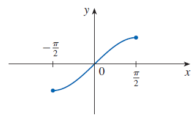
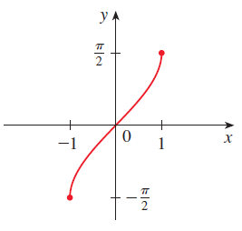
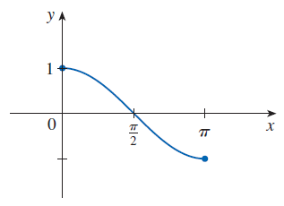
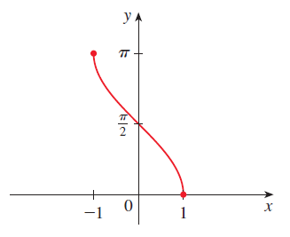
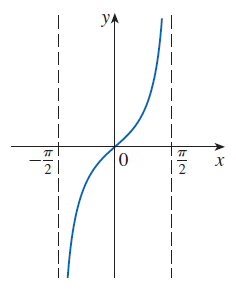
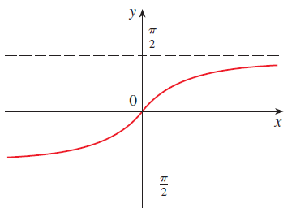

# Inverse Functions and Logarithms

## One-to-One Function

A function $f$ is called a **one-to-one function** if it *never* takes on the same value twice; that is,

$$
f(x_1) \neq f(x_2) \qquad \text{whenever } x_1 \neq x_2
$$

***Horizontal Line Test***

A function is one-to-one if and only if no horizontal line intersects its graph more than once.

This function is *not* one-to-one because $f(x_1) = f(x_2)$.

## Inverse Functions

Let $f$ be a one-to-one function with domain $A$ and range $B$.
Then its **inverse function** $f^{-1}$ has domain $B$ and range $A$ and is defined by

$$
f^{-1}(y) = x \iff f(x) = y
$$

for any $y$ in $B$.

This definition says that if $f$ maps $x$ into $y$, then $f^{-1}$ maps $y$ back into $x$. (If $f$ were not one-to-one, then $f^{-1}$ would not be uniquely defined.)

Note that

- domain of $f^{-1}$ range of $f$
- range of $f^{-1}$ domain of $f$

$f^{-1}(x)$ does *not* mean $\dfrac{1}{f(x)}$.

---

The letter $x$ is traditionally used as the independent variable, so when we concentrate on $f^{-1}$ rather than on $f$, we usually reverse the roles of $x$ and $y$ in Definition and write

$$
f^{-1}(x) = y \iff f(y) = x
$$

***Cancellation Equations***

$$
\begin{align}
f^{-1}(f(x)) = x && \text{for every } x \text{ in } A \\\\
f(f^{-1}(x)) = x && \text{for every } x \text{ in } B
\end{align}
$$

***How to Find the Inverse Function of a One-to-One Function $f$***

- 

    Write $y = f(x)$.

  

- 

    Solve this equation for $x$ in terms of $y$ (if possible).

  

- 

    To express $f^{-1}$ as a function of $x$, interchange $x$ and $y$. The resulting equation is $y = f^{-1}(x)$.

  

Find the inverse function of $f(x) = x^3 + 2$.

---

- 

    Write $y = x^3 + 2$.

  

- 

    Then we solve this equation for $x$:

    $$
    x = \sqrt[3]{y - 2}
    $$

  

- 

    Finally, we interchange $x$ and $y$:

    $$
    y = \sqrt[3]{x - 2}
    $$

  

Therefore the inverse function is $f^{-1}(x) = \sqrt[3]{x - 2}$

***Graph***

The graph of $f^{-1}$ is obtained by reflecting the graph of $f$ about the line $y = x\,$.

## Logarithmic Functions

If $b > 0$ and $b \neq 1$, the exponential function $f(x) = b^x$ is either increasing or decreasing and so it is one-to-one by the Horizontal Line Test. It therefore has an inverse function $f^{-1}$, which is called the **logarithmic function with base b** and is denoted by $log_b$.

$$
log_b x = y \iff b^y = x
$$

***Cancellation Equations***

$$
\begin{align}
\log_b (b^x) = x && \text{for every } x \in \mathbb{R} \\\\
b^{\log_b x} = x && \text{for every } x > 0
\end{align}
$$

### Laws of Logarithms

If $x$ and $y$ are positive numbers, then

- $\log_b (xy) = \log_b x + \log_b y$
- $\log_b \Big( \dfrac{x}{y} \Big) = \log_b x - \log_b y$
- $\log_b (x^r) = r \log_b x$ where $r$ is any real number

### Natural Logarithms

The logarithm with base $e$ is called the **natural logarithm** and has a special notation:

$$
\log_e x = \ln x
$$

***Cancellation Equations***

$$
\begin{align}
\ln (e^x) = x && x \in \mathbb{R} \\\\
e^{\ln x} = x && x > 0
\end{align}
$$

***$x = 1$***

$$
\ln e = 1
$$

***Rewrite the Power Of x in an Equivalent Exponential Form***

$$
x^r = e^{\ln (x^r)} = e^{r \ln x} \qquad x > 0
$$

### Change of Base Formula

For any positive number $b (b \neq 1)$, we have

$$
\log_b x = \dfrac{\ln x}{\ln b}
$$

## Inverse Trigonometric Functions

***Arcsine***

The inverse function of this *restricted* sine function $f$ exists and is denoted by $sin^{-1}$ or arcsin. It is called the **inverse sine function** or the **arcsine function**.

| $$y = \sin x,\ -\dfrac{\pi}{2} \leq x \leq \dfrac{\pi}{2}$$ | $$y = \sin^{-1} x = \arcsin x$$ |
| ----------------------------------------------------------- | ------------------------------- |
|                                          |              |

$$
\begin{align}
& \sin^{-1}(\sin x) = x && \text{for } -\dfrac{\pi}{2} \leq x \leq \dfrac{\pi}{2} \\\\
& \sin(\sin^{-1} x) = x && \text{for } -1 \leq x \leq 1
\end{align}
$$

***Arccosine***

$$
\cos^{-1} x = y \iff \cos y = x \text{ and } 0 \leq y \leq \pi
$$

| $$y = \cos x,\ 0 \leq x \leq \pi$$ | $$y = \cos^{-1} x = \arccos x$$ |
| ---------------------------------- | ------------------------------- |
|                 |              |

***Arctangent***

$$
\tan^{-1} x = y \iff \tan y = x \text{ and } -\dfrac{\pi}{2} < y < \dfrac{\pi}{2}
$$

| $$y = \tan x,\ -\dfrac{\pi}{2} < x < \dfrac{\pi}{2}$$ | $$y = \tan^{-1} x = \arctan x$$ |
| ----------------------------------------------------- | ------------------------------- |
|                                    |              |

**The Remaining Inverse Trigonometric Functions**

The remaining inverse trigonometric functions are not used as frequently and are summarized here.

$$
\begin{align}
& y = \csc^{-1} x \quad ( |x| \geq 1 ) \iff \csc y = x \text{ and } y \in (0, \dfrac{\pi}{2}] \cup (\pi, \dfrac{3\pi}{2}] \\\\
& y = \sec^{-1} x \quad ( |x| \geq 1 ) \iff \sec y = x \text{ and } y \in [0, \dfrac{\pi}{2}) \cup [\pi, \dfrac{3\pi}{2}) \\\\
& y = \cot^{-1} x \quad ( x \in \mathbb{R} ) \iff \cot y = x \text{ and } y \in (0, \pi)
\end{align}
$$

The choice of intervals for $y$ in the definitions of $\csc^{-1}$ and $\sec^{-1}$ is *not* universally agreed upon.

Some authors use $y \in [0, \dfrac{\pi}{2}) \cup (\dfrac{\pi}{2}, \pi]$ in the definition of $\sec^{-1}$.

