# Pointers and Addresses

Let us begin with a simplified picture of how memory is organized. A typical machine has an array of consecutively numbered or addressed memory cells that may be manipulated individually or in contiguous groups.

One common situation is that any byte can be a `char`, a pair of one-byte cells can be treated as a `short` integer, and four adjacent bytes form a `long`. A pointer is a group of cells (often two or four) that can hold an address.

So if `c` is a `char` and `p` is a pointer that points to it, we could represent the situation this way:

```graphviz
digraph {
    {
        node [shape=none];
        m [label="memory"];
    }
    {
        node [shape=record];
        hw [label="&nbsp;&nbsp;...&nbsp;&nbsp;|<p>&#10624;|&#10624;|&#10624;|&nbsp;&nbsp;...&nbsp;&nbsp;|<c>&#10624;|&#10624;|&#10624;|&#10624;|&nbsp;&nbsp;...&nbsp;&nbsp;"];
    }
    {rank=same; m; hw;}
    hw:p -> hw:c [headlabel="c\n\n", taillabel="p\n\n"];
}
```



## Address-Of Operator

The unary operator `&` gives the address of an object, so the statement

```c
p = &c;
```

assigns the address of `c` to the variable `p`, and `p` is said to “point to” `c`.

The `&` operator only applies to objects in memory:

- Variables
- Array elements

It *cannot* be applied to expressions, constants, or `register` variables.

<div class="alert-note">

?> [C89 &sect;3.3.3.2 Address and indirection operators][]

The result of the unary `&` (address-of) operator is a pointer to the object or function designated by its operand.

- If the operand has type “type”, the result has type “pointer to type”.

[C89 &sect;3.3.3.2 Address and indirection operators]: https://port70.net/~nsz/c/c89/c89-draft.html#3.3.3.2

</div>

## Dereference Operator

The unary operator `*` is the *indirection* or *dereferencing* operator; when applied to a pointer, it accesses the object the pointer points to.

<div class="alert-note">

?> [C89 &sect;3.3.3.2 Address and indirection operators][]

The unary `*` operator denotes indirection.

- If the operand points to a function, the result is a function designator;
- if it points to an object, the result is an lvalue designating the object.

If the operand has type “pointer to type”, the result has type “type”.

If an invalid value has been assigned to the pointer, the behavior of the unary `*` operator is undefined.

</div>

<div class="alert-example">

Suppose that `x` and `y` are integers and `ip` is a pointer to `int`. This artificial sequence shows how to declare a pointer and how to use `&` and `*`:

```c
int x = 1, y = 2, z[10];
int *ip;    /* ip is a pointer to int */

ip = &x;    /* ip now points to x */
y = *ip;    /* y is now 1 */
*ip = 0;    /* x is now 0 */
ip = &z[0]; /* ip now points to z[0] */
```

The declaration of `x`, `y`, and `z` are what we've seen all along. The declaration of the pointer `ip`,

```c
int *ip;
```

is intended as a mnemonic; it says that the expression `*ip` is an `int`. The syntax of the declaration for a variable mimics the syntax of expressions in which the variable might appear.

</div>

This reasoning applies to function declarations as well.

<div class="alert-example">

```c
double *dp, atof(char *);
```

says that in an expression `*dp` and `atof(s)` have values of `double`, and that the argument of `atof` is a pointer to `char`.

</div>

You should also note the implication that a pointer is constrained to point to a particular kind of object: every pointer points to a specific data type. (There is one exception: a “pointer to `void”` is used to hold any type of pointer but cannot be dereferenced itself. We'll come back to it in [5-11][].)

[5-11]: /notes/programming-language/c/c89/ch05/5-11

<div class="alert-example">

<mark>If `ip` points to the integer `x`, then `*ip` can occur in any context where `x` could</mark>, so

```c
*ip = *ip + 10;
```

increments `*ip` by 10.

</div>

The unary operators `*` and `&` bind more tightly than arithmetic operators, so the assignment

```c
y = *ip + 1
```

takes whatever `ip` points at, adds 1, and assigns the result to `y`, while

```c
*ip += 1
```

increments what `ip` points to, as do

```c
++*ip
```

and

```c
(*ip)++
```

The parentheses are necessary in this last example; without them, the expression would increment `ip` instead of what it points to, because unary operators like `*` and `++` associate right to left.

Finally, since pointers are variables, they can be used without dereferencing.

<div class="alert-example">

If `iq` is another pointer to `int`,

```c
iq = ip
```

copies the contents of `ip` into `iq`, thus making `iq` point to whatever `ip` pointed to.

</div>
