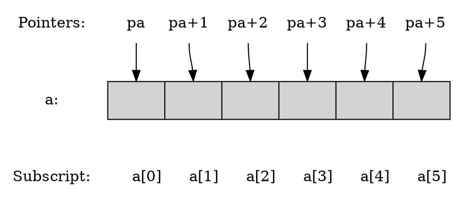

# Pointers and Arrays

In C, there is a strong relationship between pointers and arrays, strong enough that pointers and arrays should be discussed simultaneously.



<mark>Any operation that can be achieved by array subscripting can also be done with pointers.</mark> <mark>The pointer version will in general be faster</mark> but, at least to the uninitiated, somewhat harder to understand.

***Array***

The declaration

```c
int a[10];
```

defines an array of size 10, that is, a block of 10 consecutive objects named `a[0]`, `a[1]`, ...,`a[9]`.

The notation `a[i]` refers to the `i`-th element of the array.

<div class="alert-note">

?> [C89 &sect;3.3.2.1 Array subscripting][]

A postfix expression followed by an expression in square brackets `[]` is a subscripted designation of a member of an array object.

The definition of the subscript operator `[]` is that `E1[E2]` is identical to `(*(E1+(E2)))`. Because of the conversion rules that apply to the binary `+` operator,

- if `E1` is an array object (equivalently, a pointer to the initial member of an array object)
- and `E2` is an integer, `E1[E2]` designates the `E2`-th member of `E1` (counting from zero).

[C89 &sect;3.3.2.1 Array subscripting]: https://port70.net/~nsz/c/c89/c89-draft.html#3.3.2.1

</div>

***Pointer***

If `pa` is a pointer to an integer, declared as

```c
int *pa;
```

then the assignment

```c
pa = &a[0];
```

sets `pa` to point to element zero of `a`; that is, `pa` contains the address of `a[0]`.

Now the assignment

```c
x = *pa;
```

will copy the contents of `a[0]` into `x`.

---

If `pa` points to a *particular element* of an array, then by definition:

- `pa + 1` points to the next element.
- `pa + i` points `i` elements after `pa`.
- `pa - i` points `i` elements before.

<div class="alert-example">

Thus, if `pa` points to `a[0]`:

- `*(pa + 1)` refers to the contents of `a[1]`.
- `pa + i` is the address of `a[i]`.
- `*(pa + i)` is the contents of `a[i]`.

</div>

These remarks are true <mark>regardless of the type or size of the variables in the array</mark> `a`. The meaning of “adding 1 to a pointer,” and by extension, all pointer arithmetic, is that `pa + 1` points to the next object, and `pa + i` points to the `i`-th object beyond `pa`.

<div class="alert-note">

?> [C89 &sect;3.3.6 Additive operators][]

When an expression that has integral type is added to or subtracted from a pointer,

- the integral value is first <mark>multiplied by the size of the object pointed to</mark>.
- The result has the type of the pointer operand.

If the pointer operand points to a member of an array object, and the array object is large enough, the result points to a member of the same array object, appropriately *offset* from the original member.

- Thus if `P` points to a member of an array object, the expression `P + 1` points to the next member of the array object.

[C89 &sect;3.3.6 Additive operators]: https://port70.net/~nsz/c/c89/c89-draft.html#3.3.6

</div>

The correspondence between indexing and pointer arithmetic is very close. <mark>By definition, the value of a variable or expression of type array is the address of element zero of the array.</mark>

<div class="alert-example">

Thus after the assignment

```c
pa = &a[0];
```

`pa` and `a` have identical values. Since the name of an array is a synonym for the location of the initial element, the assignment `pa = &a[0]` can also be written as

```c
pa = a;
```

- Rather more surprising, at first sight, is the fact that a reference to `a[i]` can also be written as `*(a + i)`. <mark>In evaluating `a[i]`, C converts it to `*(a + i)` immediately;</mark> the two forms are equivalent.
- Applying the operator `&` to both parts of this equivalence, it follows that `&a[i]` and `a + i` are also identical: `a + i` is the address of the `i`-th element beyond `a`.
- As the other side of this coin, if `pa` is a pointer, expressions might use it with a subscript; `pa[i]` is identical to `*(pa + i)`. In short, <mark>an array-and-index expression is equivalent to one written as a pointer and offset.</mark>

</div>

## Their Difference

There is one difference between an array name and a pointer that must be kept in mind.

- A pointer is a variable, so `pa = a` and `pa++` are legal.
- But an array name is *not* a variable; constructions like `a = pa` and `a++` are illegal.

---

When an array name is passed to a function, what is passed is the location of the *initial element*.

- Within the called function, this argument is a local variable, and so an array name parameter is a pointer, that is, a variable containing an address.

<div class="alert-example">

We can use this fact to write another version of `strlen`, which computes the length of a string.

```c
/* strlen: return length of string s */
int strlen(char *s)
{
    int n;

    for (n = 0; *s != '\0', s++) {
        n++;
    }
    
    return n;
}
```

- Since `s` is a pointer, incrementing it is perfectly legal;
- `s++` has no effect on the character string in the function that called `strlen`, but merely increments `strlen`'s private copy of the pointer.

That means that calls like

```c
strlen("hello, world"); /* string constant */
strlen(array);          /* char array[100]; */
strlen(ptr);            /* char *ptr; */
```

all work.

</div>

When an array name is passed to a function, the function can at its convenience believe that it has been handed either an array or a pointer, and manipulate it accordingly.

As formal parameters in a function definition,

```c
f(char s[]) { ... }
```

and

```c
f(char *s) { ... }
```

are equivalent; <mark>we prefer the latter because it says more explicitly that the variable is a pointer.</mark> It can even use both notations if it seems appropriate and clear.

---

It is possible to pass *part* of an array to a function, by passing a pointer to the beginning of the subarray.

<div class="alert-example">

If `a` is an array,

```c
f(&a[2])
```

and

```c
f(a + 2)
```

both pass to the function `f` the address of the subarray that starts at `a[2]`.

Within `f`, the parameter declaration can read

```c
f(int arr[]) { ... }
```

or

```c
f(int *arr) { ... }
```

So as far as `f` is concerned, the fact that the parameter refers to part of a larger array is of no consequence.

</div>

---

<mark>If one is sure that the elements exist</mark>, it is also possible to index backwards in an array; `p[-1]`, `p[-2]`, and so on are syntactically legal, and refer to the elements that immediately precede `p[0]`. Of course, it is illegal to refer to objects that are not within the array bounds.
