In this section we will write the innards of a table-lookup package, to illustrate more aspects of structures.

# Table Lookup

This code is typical of what might be found in the symbol table management routines of a macro processor or a compiler.

<div class="alert-example">

Consider the `#define` statement. When a line like

```c
#define IN 1
```

is encountered, the name `IN` and the replacement text `1` are stored in a table. Later, when the name `IN` appears in a statement like

```c
state = IN;
```

it must be replaced by `1`.

</div>

There are two routines that manipulate the names and replacement texts.

- `install(s, t)` records the name `s` and the replacement text `t` in a table; `s` and `t` are just character strings.
- `lookup(s)` searches for `s` in the table, and returns a pointer to the place where it was found, or `NULL` if it wasn't there.

***Hash Search***

The algorithm is a hash-search:

- The incoming name is converted into a small non-negative integer, which is then used to index into an array of pointers.
- An array element points to the beginning of a linked list of blocks describing names that have that hash value. It is `NULL` (0) if no names have hashed to that value.

```graphviz
digraph {
    rankdir=LR;

    node [shape=plain];
    text [label="hash table"];

    node [shape=record, margin="0.15"];

    hashtab [label="<0> &#9679; | 0 | 0 | <3> &#9679; | 0"];
    {rank=same; hashtab; text;}

    n1 [label="<0> &#9679; | <1> &#9679; | <2> &#9679;"];
    n2 [label="<0> 0 | <1> &#9679; | <2> &#9679;"];
    n3 [label="<0> 0 | <1> &#9679; | <2> &#9679;"];

    node [shape=plain];

    n1n [label="  name1"];
    n2n [label="  name2"];
    n3n [label="  name3"];
    n1d [label="  defn1"];
    n2d [label="  defn2"];
    n3d [label="  defn3"];

    edge [headclip=false, tailclip=false]

    hashtab:0:c -> n1:0;
    hashtab:3:c -> n2:0;
    n1:0:c -> n3:0 [minlen=2];

    n1:1:c -> n1n:w;
    n1:2:c -> n1d:w;
    n2:1:c -> n2n:w;
    n2:2:c -> n2d:w;
    n3:1:c -> n3n:w;
    n3:2:c -> n3d:w;
}
```



A block in the list is a structure containing pointers to the name, the replacement text, and the next block in the list. A null next-pointer marks the end of the list.

```c
struct nlist { /* table entry: */
    struct nlist *next; /* next entry in chain */
    char *name;         /* defined name */
    char *defn;         /* replacement text */
};
```

The pointer array is just

```c
#define HASHSIZE 101

static struct nlist *hashtab[HASHSIZE]; /* pointer table */
```

The hashing function, which is used by both `lookup` and `install`, adds each character value in the string to a scrambled combination of the previous ones and returns the remainder modulo the array size. This is not the best possible hash function, but it is short and effective.

```c
/* hash: form hash value for string s */
unsigned hash(char *s)
{
    unsigned hashval;

    for (hashval = 0; *s != '\0'; s++) {
        hashval = *s + 31 * hashval; // 31 是一個小質數，能減少不同字串映射到相同雜湊值的機率。
    }

    return hashval % HASHSIZE;
}
```

Unsigned arithmetic ensures that the hash value is non-negative.

The hashing process produces a starting index in the array `hashtab`; if the string is to be found anywhere, it will be in the list of blocks beginning there. The search is performed by `lookup`. If `lookup` finds the entry already present, it returns a pointer to it; if not, it returns `NULL`.

```c
/* lookup: look for s in hashtab */
struct nlist *lookup(char *s)
{
    struct nlist *np;

    for (np = hashtab[hash(s)]; np != NULL; np = np->next) {
        if (strcmp(s, np->name) == 0) {
            return np; /* found */
        }
    }

    return NULL; /* not found */
}
```

The `for` loop in `lookup` is the standard idiom for walking along a linked list:

```c
for (ptr = head; ptr != NULL; ptr = ptr->next)
...
```

`install` uses `lookup` to determine whether the name being installed is already present; if so, the new definition will supersede the old one. Otherwise, a new entry is created. `install` returns `NULL` if for any reason there is no room for a new entry.

```c
struct nlist *lookup(char *);
char *strdup(char *);

/* install: put (name, defn) in hashtab */
struct nlist *install(char *name, char *defn)
{
    struct nlist *np;
    unsigned hashval;

    if ((np = lookup(name)) == NULL) { /* not found */
        np = (struct nlist *) malloc(sizeof(*np));

        if (np == NULL || (np->name = strdup(name)) == NULL) {
            return NULL;
        }

        hashval = hash(name);

        // 插入至 linked list 的開頭
        np->next = hashtab[hashval];
        hashtab[hashval] = np;
    } else { /* already there */
        free((void *) np->defn); /*free previous defn */
    }

    if ((np->defn = strdup(defn)) == NULL) {
        return NULL;
    }

    return np;
}
```
