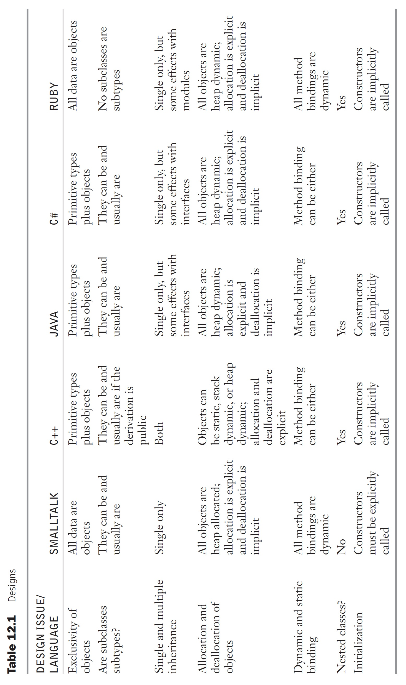

# Support for Object-Oriented Programming in Specific Languages

## Smalltalk

Many think of Smalltalk as the definitive object-oriented programming language. It was the *first language* to include complete support for that paradigm. Therefore, it is natural to begin a survey of language support for object-oriented programming with Smalltalk.

### General Characteristics

In Smalltalk, the concept of an object is truly universal. Virtually everything, from things as simple as the integer constant `2` to a complex file-handling system, is an object.

As objects, they are treated uniformly. They all have

- local memory
- inherent processing ability
- the capability to communicate with other objects
- the possibility of inheriting methods and instance variables from ancestors.

Classes cannot be nested in Smalltalk.

***Computation Is Through Messages***

All computation is through messages, even a simple arithmetic operation.

<div class="alert-example">

- The expression `x + 7` is implemented as sending the `+` message to `x` (to enact the `+` method), sending `7` as the parameter.
- This operation returns a new numeric object with the result of the addition.

</div>

Replies to messages have the form of objects and are used to

- return requested or computed information.
- Confirm that the requested service has been completed. (例如修改物件狀態並傳回自己？)

***Memory Management***

- All Smalltalk objects are allocated from the heap and are referenced through reference variables, which are implicitly dereferenced.
- There is no explicit deallocation statement or operation. So, all deallocation is implicit, using a garbage collection process for storage reclamation.

***Constructors***

- In Smalltalk, constructors must be explicitly called when an object is created.
- A class can have multiple constructors, but each must have a unique name.

***Pure Object-Oriented Design***

- Unlike a hybrid language such as C++, Smalltalk was designed for just one software development paradigm—object oriented.
- Furthermore, it adopts none of the appearance of the imperative languages. Its purity of purpose is reflected in its simple elegance and uniformity of design.

There is an example Smalltalk program in Chapter 2.

### Inheritance

Smalltalk does not support multiple inheritance.

- A Smalltalk subclass inherits all of the members of its superclass.
- The subclass can also have its own instance variables, which must have names that are distinct from the variable names in its ancestor classes.
- Finally, the subclass can define new methods and redefine methods that already exist in an ancestor class.

When a subclass has a method whose name and protocol are the same as an ancestor class, the subclass method hides that of the ancestor class. Access to such a hidden method is provided by prefixing the message with the pseudovariable `super`. The prefix causes the method search to begin in the superclass rather than locally.

Because members in a parent class cannot be hidden from subclasses, subclasses can be and usually are subtypes (principle of substitution).

### Dynamic Binding

The dynamic binding of messages to methods in Smalltalk operates as follows:

<div class="stepper">

- A message to an object causes a search of the class to which the object belongs for a corresponding method.
- <div>

    If the search fails, it is continued in the superclass of that class, and so forth, up to the system class, `Object`, which has no superclass.

    `Object` is the root of the class derivation tree on which every class is a node. If no method is found anywhere in that chain, an error occurs.

  </div>

</div>

It is important to remember that this method search is dynamic—it takes place when the message is sent. Smalltalk does not, under any circumstances, bind messages to methods statically.

---

- The only *type checking* in Smalltalk is *dynamic*,
- and the only type error occurs when a message is sent to an object that has no matching method, either *locally or through inheritance*.

This is a different concept of type checking than that of most other languages. Smalltalk type checking has the simple goal of <mark>ensuring that a message matches some method.</mark>

?> 編譯時，不檢查型別；而是在程式執行時，檢查是否存在與訊息對應的 method。

***Dynamic Polymorphism***

Smalltalk variables are not typed; any name can be bound to any object.

```smalltalk
| myVar |

"myVar 綁定到一個數字"
myVar := 42.

"myVar 現在綁定到一個字串"
myVar := 'Hello, Smalltalk!'.

"myVar 現在綁定到一個陣列"
myVar := #(1 2 3 4).
```

As a direct result, Smalltalk supports dynamic polymorphism.

- All Smalltalk code is generic in the sense that the types of the variables are irrelevant, as long as they are consistent.
- The meaning of an operation (method or operator) on a variable is determined by the class of the object to which the variable is currently bound.

```smalltalk
"print 方法的行為取決於 myVar 當前綁定的物件類別"
myVar print.
```

The point of this discussion is that

?> as long as the objects referenced in an expression have methods for the messages of the expression, the types of the objects are irrelevant. This means that no code is tied to a particular type.

### Evaluation of Smalltalk

Perhaps the greatest impact of Smalltalk is the advancement of object-oriented programming, now the most widely used design and coding methodology.

***Language Characteristics***

- Smalltalk is a small language, although the Smalltalk system is large. The syntax of the language is simple and highly regular.
- It is a good example of the power that can be provided by a small language if that language is built around a simple but powerful concept.
    - In the case of Smalltalk, that concept is that all programming can be done employing only a class hierarchy built using inheritance, objects, and message passing.

***Performance***

- In comparison with conventional compiled imperative-language programs, equivalent Smalltalk programs are significantly slower.
- Although it is theoretically interesting that array indexing and loops can be provided within the message-passing model, efficiency is an important factor in the evaluation of programming languages.

Therefore, efficiency will clearly be an issue in most discussions of the practical applicability of Smalltalk.

***Dynamic Binding***

Smalltalk’s dynamic binding allows type errors to go undetected until run time.

- A program can be written that includes messages to nonexistent methods and it will not be detected until the messages are sent,
- which causes a great deal more error repair later in the development than would occur in a static-typed language.

However, in practice type errors are not a serious problem with Smalltalk programs.

***Design Philosophy***

Overall, the design of Smalltalk consistently came down on the side of language elegance and strict adherence to the principles of object-oriented programming support, often without regard for practical matters, in particular execution efficiency. This is most obvious in the exclusive use of objects and the typeless variables.

***User Interface Contributions***

The Smalltalk user interface has had an important impact on computing:

- The integrated use of windows
- mouse-pointing devices
- pop-up and pulldown menus

all of which first appeared in Smalltalk, dominate contemporary software systems.

## C++

Chapter 2 describes how C++ evolved from C and SIMULA 67, with the design goal of support for object-oriented programming while retaining nearly complete backward compatibility with C.

- C++ classes, as they are used to support abstract data types, are discussed in Chapter 11.
- C++ support for the other essentials of object-oriented programming is explored in this section.

    The whole collection of details of C++ classes, inheritance, and dynamic binding is large and complex. This section discusses only the most important among these topics, specifically, those directly related to the design issues described in Section 12.3.

For both of these reasons, our coverage of C++ here is more detailed than that of the other example languages discussed in this chapter.

- C++ was the first widely used object-oriented programming language and is still among the most popular.
- So, naturally, it is the one with which other languages are often compared.

### General Characteristics

To maintain backward compatibility with C, C++ retains the type system of C and adds classes to it. Therefore, C++ has both

- traditional imperative-language types
- and the class structure of an object-oriented language.
    - It supports methods, as well as functions that are not related to specific classes.

This makes it a hybrid language, supporting both procedural programming and object-oriented programming.

The objects of C++ can be

- static,
- stack dynamic,
- or heap dynamic.
    - Explicit deallocation using the `delete` operator is required for heap-dynamic objects, because C++ does not include implicit storage reclamation.

Many class definitions include a destructor method, which is implicitly called when an object of the class ceases to exist.

- <mark>The destructor is used to deallocate *heap-allocated memory* that is referenced by data members.</mark>
- It may also be used to record part or all of the state of the object just before it dies, usually for debugging purposes.

### Inheritance

A C++ class can be derived from an existing class, which is then its parent, or base, class.

- Unlike Smalltalk and most other languages that support object-oriented programming, a C++ class can also be stand-alone, *without* a superclass.

***Definition of a Derived Class***

In the definition of a derived class, the name of the derived class has the name of the base class attached with a colon (`:`), as in the following syntactic form:

```cpp
class derived_class_name : base_class_name { ... }
```

- The data defined in a class definition are called *data members* of that class.
- The functions defined in a class definition are called *member functions* of that class (member functions in other languages are usually called methods).
- Some or all of the members of the base class may be inherited by the derived class, which can also add new members and modify inherited member functions.

***C++ Objects Must Be Initialized***

All C++ objects must be initialized before they are used.

- Therefore, all C++ classes include at least one constructor method that initializes the data members of the new object.
- Constructor methods are implicitly called when an object is created. If any of the data members are pointers to heap-allocated data, the constructor allocates that storage.

***Initializing Base Class in Derived Class***

If a class is derived from another class, the inherited data members must be initialized when the derived class object is created.

- To do this, the base class constructor is implicitly called.
- When initialization data must be furnished to the base class constructor, it is given in the call to the derived object constructor.
- In general, this is done with the following construct:

    ```cpp
    subclass(subclass parameters): base_class(superclass parameters) {
        ...
    }
    ```

If no constructor is included by the developer in a class definition, the
compiler includes a trivial constructor. This default constructor calls the constructor
of the base class, if there is a base class.

***Member's Access Control in C++***

Class members can be private, protected, or public.

- Private members are accessible only by member functions and friends of the class.

    Standalone functions, member functions, and classes can be declared to be friends of a class and thereby be given access to its private members.

- Public members are visible everywhere.
- Protected members are like private members, except in derived classes, whose access is described next.

***Derivation Mode***

Derived classes can modify accessibility for their inherited members. The complete syntactic form of a derived class is as follows:

```cpp
class derived_class_name : derivation_mode base_class_name {
    // data member and member function declarations
};
```

The `derivation_mode` can be either `public` or `private`. (Do not confuse public and private *derivation* with public and private *members*.)

- The public and protected members of a base class are also public and protected, respectively, in a public-derived class.
- In a private-derived class, both the public and protected members of the base class are private.

  ?> So, in a class hierarchy, a private-derived class cuts off access to all members of all ancestor classes to all successor classes.

    Private members of a base class are inherited by a derived class, but they are not visible to the members of that derived class and are therefore of no use there.

Private derivations provide the possibility that a subclass can have members with different access than the same members in the parent class.

<div class="alert-example">

Consider the following example:

```cpp
class base_class {
    // 子類別無法直接存取 base_class 的 private 成員，
    // 只能透過 base_class 提供的 public 或 protected 方法「間接」存取
    private:
        int a;
        float x;

    // 可以被子類別直接存取
    protected:
        int b;
        float y;

    public:
        int c;
        float z;
};

// public 繼承：
// - protected 成員會保留為 protected
// - public 成員會保留為 public
// - 子類別無法直接存取 private 成員
class subclass_1 : public base_class { ... };

// private 繼承：
// - base_class 的 public 和 protected 成員都會變成 private 成員
// - 因此 subclass_2 的子類別無法存取 base_class 的 protected 和 public 成員
class subclass_2 : private base_class { ... };
```

- In `subclass_1`, `b` and `y` are protected, and `c` and `z` are public.
- In `subclass_2`, `b`, `y`, `c`, and `z` are private.

No derived class of `subclass_2` can have members with access to any member of `base_class`.

The data members `a` and `x` in `base_class` are not accessible in either `subclass_1` or `subclass_2`.

</div>

- Note that private-derived subclasses cannot be subtypes.
- However, public-derived subclasses can be and usually are subtypes.

<div class="alert-example">

If the base class has a public data member, under private derivation that data member would be private in the subclass. Therefore, if an object of the subclass were substituted for an object of the base class, accesses to that data member would be illegal on the subclass object.

```cpp
class Base {
    public:
        int publicMember = 42;
        void show() {
            cout << "Base publicMember: " << publicMember << endl;
        }
};

class DerivedPrivate : private Base {
    public:
        void accessBase() {
            // 子類別內部可以訪問 Base 的 publicMember，因為它被繼承為 private
            cout << "DerivedPrivate accessing Base member: " << publicMember << endl;
        }
};

int main() {
    Base baseObj;
    DerivedPrivate derivedObj;

    // 合法：
    baseObj.show(); // Base 的 public 方法
    derivedObj.accessBase(); // 在子類別內部可以訪問

    // 不合法：
    derivedObj.show(); // 無法呼叫：
                       // - Base 的 public 方法在 DerivedPrivate 中變為 private
    cout << derivedObj.publicMember; // 無法存取：
                                     // - Base 的 public 成員在 DerivedPrivate 中變為 private
    // 因為上述行為不合法，違反 principle of substitution
    // 所以 DerivedPrivate 無法作為 Base 的 subtype 來替換 

    return 0;
}
```

</div>

Under private class derivation, no member of the parent class is implicitly visible to the instances of the derived class. Any member that must be made visible must be reexported in the derived class. This reexportation in effect exempts a member from being hidden even though the derivation was private.

<div class="alert-example">

Consider the following class definition:

```cpp
class subclass_3 : private base_class {
    base_class::c; // 將 c 重新導出
                     // 即使是 private class derivation
                     // 也能讓 subclass_3 的實例能夠直接訪問它
    ...
}

int main() {
    subclass_3 obj;
    cout << obj.c // 重新導出後就可以直接存取
    return 0;
}
```

Now, instances of `subclass_3` can access `c`. As far as `c` is concerned, it is as if
the derivation had been public. The double colon (`::`) in this class definition
is a scope resolution operator. It specifies the class where its following entity
is defined.

</div>

The example in the following paragraphs illustrates the purpose and use of private derivation.

<div class="alert-example">

Consider the following example of C++ inheritance, in which a general linked-list class is defined and then used to define two useful subclasses:

```cpp
class single_linked_list {
    private:
        class node { // 巢狀類別： node 只在 single_linked_list 中被使用
            public:
                node *link;
                int contents;
        };
        node *head;
    public:
        single_linked_list() { head = 0 };
        void insert_at_head(int);
        void insert_at_tail(int);
        int remove_at_head();
        int empty();
};
```

The nested class, `node`, defines a cell of the linked list to consist of an integer variable and a pointer to a `node` object.

- The `node` class is in the private clause, which hides it from all other classes.
- Its members are public, however, so they are visible to the nesting class, `single_linked_list`.
- If they were private, `node` would need to declare the nesting class to be a friend to make them visible in the nesting class.

Note that nested classes have no special access to members of the nesting class. Only static data members of the nesting class are visible to methods of the nested class.

- The enclosing class, `single_linked_list`, has just a single data member, a pointer to act as the list’s header.
    - It contains a constructor function, which sets `head` to the null pointer value.
- The four member functions allow
    - nodes to be inserted at either end of a list object,
    - nodes to be removed from one end of a list,
    - and lists to be tested for empty.

***Public Derivation***

The following definitions provide stack and queue classes, both based on the `single_linked_list` class:

```cpp
class stack : public single_linked_list {
    public:
        stack() {}
        void push(int value) {
            insert_at_head(value);
        }
        int pop() {
            return remove_at_head();
        }
};

class queue : public single_linked_list {
    public:
        queue() {}
        void enqueue(int value) {
            insert_at_tail(value);
        }
        int dequeue() {
            remove_at_head();
        }
};
```

Note that objects of both the `stack` and `queue` subclasses can access the `empty` function defined in the base class, `single_linked_list` (because it is a public derivation).

Both subclasses define constructor functions that do nothing.

- When an object of a subclass is created, the proper constructor in the subclass is implicitly called. Then, any applicable constructor in the base class is called.
- So, in our example, when an object of type `stack` is created,

  <div class="stepper">

    - <div>

        the constructor in `single_linked_list` is called, which does the necessary initialization.

      </div>

    - <div>

        Then the `stack` constructor is called, which does nothing.

      </div>

  </div>

The classes `stack` and `queue` both suffer from the same serious problem:

!> Clients of both can access all of the public members of the parent class, `single_linked_list`.

- A client of a `stack` object could call `insert_at_tail`, thereby destroying the integrity of its stack.
- Likewise, a client of a `queue` object could call `insert_at_head`.

These unwanted accesses are allowed because both `stack` and `queue` are subtypes of `single_linked_list`.

?> Public derivation is used when one wants the subclass to inherit the entire interface of the base class.

***Private Derivation***

The alternative is to use a derivation in which the subclass inherits only the implementation of the base class. Our two example derived classes can be written to make them not subtypes of their parent class by using *private*, rather than *public*, *derivation*.

Then, both will also need to reexport `empty`, because it will become hidden to their instances. This situation illustrates the motivation for the private-derivation option.

The new definitions of the stack and queue types, named `stack_2` and `queue_2`, are shown in the following:

```cpp
class stack_2 : private single_linked_list {
    public:
        stack_2() {}
        void push(int value) {
            single_linked_list::insert_at_head(value);
        }
        int pop() {
            return single_linked_list::remove_at_head();
        }
        single_linked_list::empty();
};

class queue_2 : private single_linked_list {
    public:
        queue_2() {}
        void enqueue(int value) {
            single_linked_list::insert_at_tail(value);
        }
        int dequeue() {
            single_linked_list::remove_at_head();
        }
        single_linked_list::empty();
};
```

These two classes use reexportation to allow access to base class methods for clients. This was not necessary when public derivation was used.

The linked list is a generalization of both stacks and queues, because both can be implemented as linked lists.

- So, it is natural to inherit from a linked-list class to define stack and queue classes.
- However, neither is a subtype of the linked-list class, because both make the public members of the parent class private, which makes them inaccessible to clients.

---

The two versions of stack and queue illustrate the difference between subtypes and derived types that are not subtypes.

</div>

***Friends***

One of the reasons friends are necessary is that sometimes a subprogram must be written that can access the members of two different classes.

<div class="alert-example">

Suppose a program uses a class for vectors and one for matrices, and a subprogram is needed to multiply a matrix object by a vector object.

In C++, the multiply function can be made a friend of both classes.

</div>

***Multiple Inheritance***

As previously stated, C++ provides multiple inheritance.

<div class="alert-example">

Suppose we wanted

- a class for drawing that needed the behavior of a class written for drawing figures
- and the methods of the new class needed to run in a separate thread.

We might define the following:

```cpp
class Thread { ... };
class Drawing { ... };
class DrawThread : public Thread, public Drawing { ... };
```

Class `DrawThread` inherits all of the members of both `Thread` and `Drawing`.

- If both `Thread` and `Drawing` happen to include members with the same name, they can <mark>be unambiguously</mark> referenced in objects of class `DrawThread` <mark>by using the scope resolution operator (`::`).</mark>


Some issues with the C++ implementation of multiple inheritance are discussed in Section 12.5.

</div>

***Overriding Methods***

Overriding methods in C++ must have exactly the same parameter profile as the overridden method.

- If there is any difference in the parameter profiles, the method in the subclass is considered a new method that is unrelated to the method with the same name in the ancestor class.
- The return type of the overriding method either must be the same as that of the overridden method or must be a publicly derived type of the return type of the overridden method.

### Dynamic Binding

- All of the member functions we have defined thus far are statically bound; that is, a call to one of them is statically bound to a function definition.
- A C++ object could be manipulated through a value variable, rather than a pointer or a reference. (Such an object would be static or stack dynamic.) However, in that case, the object’s type is known and static, so dynamic binding is not needed.
- On the other hand, a pointer variable that has the type of a base class can be used to point to any heap-dynamic object of any class publicly derived from that base class, making it a polymorphic variable.
- Publicly derived subclasses are subtypes if none of the members of the base class are private.
- Privately derived subclasses are never subtypes.
- A pointer to a base class cannot be used to reference a method in a subclass that is not a subtype.

C++ does not allow value variables (as opposed to pointers or references) to be polymorphic. When a polymorphic variable is used to call a member function overridden in one of the derived classes, the call must be dynamically bound to the correct member function definition.

<div class="alert-example">

Consider the situation of having a base class named `Shape`, along with a collection of derived classes for different kinds of shapes, such as circles, rectangles, and so forth.

- If these shapes need to be displayed, then the displaying member function, `draw`, must be unique for each descendant, or kind of shape.
- These versions of `draw` must be defined to be virtual.
- When a call to `draw` is made with a pointer to the base class of the derived classes, that call must be dynamically bound to the member function of the correct derived class.

The following example has the skeletal definitions for the example situation just described:

```cpp
class Shape {
    public:
        virtual void draw() = 0;
    ...
};

class Circle : public Shape {
    public:
        void draw() { ... }
    ...
};

class Rectangle : public Shape {
    public:
        void draw() { ... }
    ...
};
```

Given these definitions, the following code has examples of both statically and dynamically bound calls:

```cpp
Circle* circ = new Circle;
Rectangle* rect = new Rectangle;
Shape* ptr_shape;

ptr_shape = circ;   // Now `ptr_shape` points to a Circle object
ptr_shape->draw();  // Dynamically bound to the draw in the Circle class
rect->draw();       // Statically bound to the draw in the Rectangle class
```

This situation is shown in Figure 12.6.

')

</div>

***Abstract Class***

Any class that includes a pure virtual function is an **abstract class**.

- In C++, an abstract class is not marked with a reserved word.
- An abstract class can include completely defined methods. Because of the presence of one or more virtual functions, it is illegal to instantiate an abstract class.
- In a strict sense, an abstract class is one that is used only to represent the characteristics of a type. C++ provides abstract classes to model these truly abstract classes.
- If a subclass of an abstract class does not redefine a pure virtual function of its parent class, that function remains as a pure virtual function in the subclass and the subclass is also an abstract class.

Abstract classes and inheritance together support a powerful technique for software development. They allow types to be hierarchically defined so that related types can be subclasses of truly abstract types that define their common abstract characteristics.

Dynamic binding allows the code that uses members like `draw` to be written before all or even any of the versions of `draw` are written. New derived classes could be added years later, without requiring any change to the code that uses such dynamically bound members. This is a highly useful feature of object-oriented languages.

<div class="alert-example">

?> Reference assignments for *stack-dynamic* objects are different from pointer assignments for *heap-dynamic* objects.

Consider the following code, which uses the same class hierarchy as the last example:

```cpp
Circle circ;    // Allocate a Circle object on the stack
Rectangle rect; // Allocate a Rectangle object on the stack

rect = circ;    // Copies the data member values from the Circle object
rect.draw();    // Calls the draw from the Rectangle object
```

In the assignment `rect = circ`,

- the member data from the object referenced by `circ` would be assigned to the data members of the object referenced by `rect`, but `rect` would still reference the `Rectangle` object.
- Therefore, the call to `draw` through the object referenced by `rect` would be that of the `Rectangle` class.

If `rect` and `circ` were pointers to heap-dynamic objects,

- the same assignment would be a pointer assignment, which would make `rect` point to the `Circle` object,
- and a call to `draw` through `rect` would be bound dynamically to the `draw` in the `Circle` object.

</div>

### Evaluation (C++ vs. Smalltalk)

It is natural to compare the object-oriented features of C++ with those of Smalltalk.

***Inheritance***

The inheritance of C++ is more intricate than that of Smalltalk in terms of access control. By

- using both the access controls within the class definition and the derivation access controls,
- and also the possibility of friend functions and friend classes,

the C++ programmer has highly detailed control over access to class members.

Although C++ provides multiple inheritance and Smalltalk does not, there are many who feel that is not an advantage for C++.

- The downsides of multiple inheritance weigh heavily against its value. In fact, C++ is the only language discussed in this chapter that supports multiple inheritance.
- On the other hand, languages that provide alternatives (例如：interface, abstract class, ...) to multiple inheritance, such as Java and C#, clearly have an advantage over Smalltalk in that area.

***Binding***

In C++, the programmer can specify whether static binding or dynamic binding is to be used.

- Because static binding is faster, this is an advantage for those situations where dynamic binding is not necessary.
- Furthermore, even the dynamic binding in C++ is fast when compared with that of Smalltalk.

---

- Binding a virtual member function call in C++ to a function definition has a *fixed cost*, regardless of how distant in the inheritance hierarchy the definition appears. Calls to virtual functions require only five more memory references than statically bound calls.
- In Smalltalk, however, messages are always dynamically bound to methods, and the farther away in the inheritance hierarchy the correct method is, the longer it takes.

The disadvantage of allowing the user to decide which bindings are static and which are dynamic is that the original design must include these decisions, which may have to be changed later.

***Type Checking***

The static type checking of C++ is an advantage over Smalltalk.

- In Smalltalk all type checking is dynamic. A Smalltalk program can be written with messages to nonexistent methods, which are not discovered until the program is executed.
- A C++ compiler finds such errors. Compiler-detected errors are less expensive to repair than those found in testing.

Smalltalk is essentially typeless, meaning that all code is effectively generic.

- This provides a great deal of flexibility, but static type checking is sacrificed.

C++ provides generic classes through its template facility (as described in Chapter 11), which retains the benefits of static type checking.

***Design Philosophy***

The primary advantage of Smalltalk lies in the elegance and simplicity of the language, which results from the single philosophy of its design. It is purely and completely devoted to the object-oriented paradigm, devoid of compromises necessitated by the whims of an entrenched user base.

C++, on the other hand, is a large and complex language with no single philosophy as its foundation, except to support object-oriented programming and include the C user base.

- One of its most significant goals was to preserve the efficiency and flavor of C while providing the advantages of object-oriented programming.
- Some people feel that the features of this language do not always fit well together and that at least some of the complexity is unnecessary.

***Efficiency***

- Smalltalk ran a particular set of small C-style benchmarks at only 10 percent of the speed of optimized C.
- C++ programs require only slightly more time than equivalent C programs.

## Java

Because Java’s design of classes, inheritance, and methods is similar to that of C++, in this section we focus only on those areas in which Java differs from C++.

### General Characteristics

As with C++, Java supports both objects and nonobject data.

- However, in Java, only values of the primitive scalar types (Boolean, character, and the numeric types) are not objects.
- Java’s enumerations and arrays are objects.

The reason Java has nonobjects is efficiency.

***Boxing and Unboxing***

In Java 5.0+, primitive values are implicitly coerced when they are put *in object context*. This coercion converts the primitive value to an object of the wrapper class of the primitive value’s type.

<div class="alert-example">

Putting an `int` value or variable into object context causes the creation of an `Integer` object with the value of the `int` primitive. This coercion is called **boxing**.

```java
int primitiveValue = 10;
Integer boxedValue = primitiveValue; // boxing
System.out.println(boxedValue); // unboxing
```

```java
List<Integer> list = new ArrayList<>();
int primitiveValue = 10;

list.add(primitiveValue); // boxing
int value = list.get(0);  // unboxing

```

</div>

***Root Class***

Whereas C++ classes can be defined to have no parent, that is not possible in Java.

All Java classes must be subclasses of the root class, `Object`, or some class that is a descendant of `Object`.

- One advantage of this is that some commonly needed methods, such as `toString` and equals, can be defined in `Object` and inherited and used by all other classes.

***Memory Management***

All Java objects are explicit heap dynamic.

- Most are allocated with the `new` operator, but there is no explicit deallocation operator.
- Garbage collection is used for storage reclamation. Like many other language features, although garbage collection avoids some serious problems, such as dangling pointers, it can cause other problems.
- One such difficulty arises because the garbage collector deallocates, or reclaims the storage occupied by an object, but it does no more.

  <div class="alert-example">

    If an object has access to some resource other than heap memory, such as a file or a lock on a shared resource, the garbage collector does *not* reclaim these.

  </div>

For these situations, Java allows the inclusion of a special method, `finalize`, which is related to a C++ destructor function.

- A `finalize` method is implicitly called when the garbage collector is about to reclaim the storage occupied by the object.
- The problem with `finalize` is that *the time* it (and the garbage collector) will run cannot be forced or even predicted.
- The alternative to using `finalize` to reclaim resources held by an object about to be garbage collected is to include a method that does the reclamation. The only problem with this is that all clients of the objects must be aware of this method and remember to call it.

### Inheritance

***Reserved Word: `final`***

In Java, a *method* can be defined to be `final`, which means that it cannot be overridden in any descendant class.

When the `final` reserved word is specified on a *class* definition, it means the class cannot be subclassed.

- All of the methods in a final class are implicitly final, which means that the bindings of method calls to the methods of the class are statically bound.

The advantage of defining a class to be final is that no changes to the class are allowed.

<div class="alert-example">

`String` is a final class and because of that any method that receives a `String` reference in a parameter can depend on the stability of the meaning of `String’s` methods.

The disadvantage is that defining a class to be final disallows reuses that require even minor modifications.

</div>

***@Override***

Java includes the annotation `@Override`, which informs the compiler to check to determine whether the following method overrides a method in an ancestor class. If it does not, the compiler issues an error message.

```java
class Animal {
    public void sound() {
        System.out.println("Animal makes a sound");
    }
}

class Dog extends Animal {
    @Override
    public void sound() {
        System.out.println("Dog barks");
    }
}
```

***Parent Class Constructor***

Like C++, Java requires that parent class constructor be called before the subclass constructor is called. If parameters are to be passed to the parent class constructor, that constructor must be explicitly called, as in the following example:

```java
super(100, true);
```

If there is no explicit call to the parent class constructor, the compiler inserts a call to the zero-parameter constructor in the parent class.

***Java’s Subclasses Can Be Subtypes***

Java does not support the private derivations of C++.

- One can surmise that the Java designers believed that subclasses should be subtypes, which they are not when private derivations are supported. Thus, they did not include them.

<div class="alert-example">

Early versions of Java included a collection, `Vector`, which included a long list of methods for manipulating data in a collection construct.

- These versions of Java also included a subclass of `Vector`, `Stack`, which added methods for push and pop operations.
- Unfortunately, because Java *does not have private derivation*, all of the methods of `Vector` were also visible in the `Stack` class, which made `Stack` objects liable to a variety of operations that could invalidate those objects.

</div>

***Interface***

Java directly supports only single inheritance. However, it includes a kind of abstract class, called an **interface**, which provides partial support for multiple inheritance.

- An interface definition is similar to a class definition, except that it can contain *only named constants* and *method declarations* (not definitions).
- It cannot contain constructors, nonabstract methods, or variable declarations.

So, an interface is no more than what its name indicates—it defines only the specification of a class. (Recall that a C++ abstract class can have instance variables and all but one of the methods can be completely defined.)

- A class does not inherit an interface; it implements it.
- In fact, a class can implement any number of interfaces.
- To implement an interface, the class must implement all of the methods whose specifications (but not bodies) appear in the interface definition.

---

An interface can be used to <mark>simulate multiple inheritance.</mark>

- A class can be derived from a class and implement an interface, with the interface taking the place of a second parent class.
- This is sometimes called **mixin inheritance**, because the constants and methods of the interface are mixed in with the methods and data inherited from the superclass, as well as any new data and/or methods defined in the subclass.

---

One more interesting capability of interfaces is that they provide another kind of *polymorphism*. This is because interfaces can be treated as types.

<div class="alert-example">

A method can specify a formal parameter that is an interface. Such a formal parameter can accept an actual parameter of any class that implements the interface, making the method polymorphic.

</div>

---

A nonparameter variable also can be declared to be of the type of an interface. Such a variable can reference any object of any class that implements the interface.

<div class="alert-example">

```java
interface Animal { ... }
class Cat implements Animal { ... }

public static void main(String[] args) {
    Animal myAnimal;
    myAnimal = new Cat();
}
```

</div>

---

One of the problems with multiple inheritance occurs when a class is derived from two parent classes and both define a public method with the same name and protocol.

- This problem is avoided with interfaces.
- Although a class that implements an interface must provide definitions for all of the methods specified in the interface, if the class and the interface both include methods with the same name and protocol, the class need not reimplement that method.
- So, the method name conflicts that can occur with multiple inheritance cannot occur with single inheritance and interfaces.
- Furthermore, variable name conflicts are completely avoided because interfaces cannot define variables.

<div class="alert-example">

- C++ 的多重繼承可能導致方法來源重複，當多個父類別中定義了同名且參數相同的方法時，編譯器無法判斷應使用哪個版本，從而產生歧義。
- 相較之下，Java 透過介面模擬多重繼承，並要求開發者在遇到衝突時顯式解決，從而有效避免此類問題的發生。

<!-- tabs:start -->

<!-- tab:C++ -->

```cpp
class Parent1 {
    public:
        void display() { cout << "Parent1 display" << endl; }
};

class Parent2 {
    public:
        void display() { cout << "Parent2 display" << endl; }
};

// Multiple inheritance
class Child : public Parent1, public Parent2 {
    // Ambiguity: which 'display' method does Child inherit?
};

int main() {
    Child c;
    c.display(); // error: request for member ‘display’ is ambiguous
    return 0;
}
```

<!-- tab:Java -->

```java
interface Parent1 {
    default void display() { System.out.println("Parent1 display"); }
}

interface Parent2 {
    default void display() { System.out.println("Parent2 display"); }
}

// Class implementing both interfaces
class Child implements Parent1, Parent2 {
    @Override
    public void display() {
        // Resolve ambiguity explicitly
        Parent1.super.display(); // Call Parent1's display method
        Parent2.super.display(); // Call Parent2's display method
    }
}

public class Main {
    public static void main(String[] args) {
        Child child = new Child();
        child.display();
    }
}
```

<!-- tabs:end -->

</div>

***Interface vs. Multiple Inheritance***

An interface is not a replacement for multiple inheritance, because in multiple inheritance there is code reuse, while interfaces provide no code reuse.

- This is an important difference, because code reuse is one of the primary benefits
of inheritance.
- Java provides one way to partially avoid this deficiency. One of the implemented interfaces could be replaced by an abstract class, which could include code that could be inherited, thereby providing some code reuse.

One problem with interfaces being a replacement for multiple inheritance is the following:

- If a class attempts to implement two interfaces and both define methods that have the same name and protocol, there is no way to implement both in the class.

    <div class="example">

    ```java
    interface InterfaceA { void display(); }
    interface InterfaceB { void display(); }

    class MyClass implements InterfaceA, InterfaceB {
        @Override
        public void display() {
            System.out.println("Which interface's display method am I implementing?");
        }
    }
    ```

    </div>

***Example of Interface***

Consider the `sort` method of the standard Java class, `Array`.

- Any class that uses this method must provide an implementation of a method to compare the elements to be sorted.
- The generic `Comparable` interface provides the protocol for this comparing method, which is named `compareTo`.

The code for the `Comparable` interface is as follows:

```java
public interface Comparable <T> {
    public int compareTo(T b);
}
```

The `compareTo` method must return a

- negative integer if the object through which it is called belongs before the parameter object,
- zero if they are equal,
- and a positive integer if the parameter belongs before the object through which `compareTo` was called.

A class that implements the `Comparable` interface can sort the contents of any array of objects of the generic type, as long as the implemented `compareTo` method for the generic type is implemented and provides the appropriate value.

<div class="alert-example">

```java
public static void main(String[] args) {
    Student[] students = {
        new Student("Alice", 85),
        new Student("Bob", 92),
        new Student("Charlie", 78)
    };

    // 使用 Arrays.sort() 按成績由小到大排序
    Arrays.sort(students);

    for (Student student : students) {
        System.out.println(student.getName() + " - " + student.getGrade());
    }
}

class Student implements Comparable<Student> {
    private String name;
    private int grade;

    public Student(String name, int grade) {
        this.name = name;
        this.grade = grade;
    }

    public String getName() { return name; }
    public int getGrade() { return grade; }

    @Override
    public int compareTo(Student other) {
        return this.grade - other.grade; // 按成績升序排序
    }
}
```

</div>

Interfaces have become a common substitute for multiple inheritance. Some form of interfaces are now part of C#, Swift, Ruby, and Ada.

***Java’s Abstract Classes***

?> 當某些方法需要在子類別實作，而其他方法可以預先定義時，可以使用抽象類別。

In addition to interfaces, Java also supports abstract classes, similar to those of C++.

- The abstract methods of a Java abstract class are represented as just the method’s header, which includes the `abstract` reserved word.
- The abstract class is also marked abstract. Of course, abstract classes cannot be instantiated.

Chapter 14 illustrates the use of interfaces in Java event handling.

### Dynamic Binding

- In C++, a method must be defined as virtual to allow dynamic binding.
- In Java, all method calls are dynamically bound
    - unless the called method has been defined as `final`, in which case it cannot be overridden and all bindings are static.
    - Static binding is also used if the method is `static` or `private`, both of which disallow overriding.

### Nested Classes

Java has several varieties of nested classes, all of which have the advantage of being hidden from all classes in their package, except for the nesting class.

- *Nonstatic* classes that are nested directly in another class are called **inner classes**.
    - Each instance of an inner class must have an implicit pointer to the instance of its nesting class to which it belongs.
    - This gives the methods of the nested class access to all of the members of the nesting class, including the private members.
- *Static* nested classes do not have this pointer, so they cannot access members of the nesting class. Therefore, static nested classes in Java are like the nested classes of C++.

---

Though it seems odd in a static-scoped language, the members of the inner class, even the private members, are accessible in the outer class. Such references must include the variable that references the inner class object.

<div class="alert-example">

Suppose the outer class creates an instance of the inner class with the
following statement:

```java
myInner = this.new Inner();
```

Then, if the inner class defines a variable named `sum`, it can be referenced in the outer class as `myInner.sum`.

</div>

---

- An instance of a nested class can only exist within an instance of its nesting class.
- Nested classes can also be anonymous.
- Anonymous nested classes have complex syntax but are really only an abbreviated way to define a class that is used from just one location.

An example of an anonymous nested class appears in Chapter 14.

***Local Nested Class***

A **local nested class** is defined in a method of its nesting class.

- Local nested classes are never defined with an access specifier (`private` or `public`).
- Their scope is always limited to their nesting class.
- A method in a local nested class can access the variables defined in its nesting class and the `final` variables defined in the method in which the local nested class is defined.
- The members of a local nested class are visible only in the method in which the local nested class is defined.

```java
public static void main(String[] args) {
    OuterClass oc = new OuterClass();
    oc.someMethod();
}

public class OuterClass {
    public void someMethod() {
        // 變數必須是 final 或 effectively final 才能被 Local nested class 使用
        final int localVariable = 10;
        int nonFinalVariable = 20;

        // Local nested class
        class LocalNestedClass {
            public void display() {
                System.out.println(localVariable);
                System.out.println( // compilation error
                  nonFinalVariable
                );
            }
        }

        LocalNestedClass localObj = new LocalNestedClass();
        nonFinalVariable = 30; // 重新賦值後，便不再是 effectively final 了
        localObj.display();
    }
}
```

### Evaluation

Java’s design for supporting object-oriented programming is similar to that of C++, but it employs more consistent adherence to object-oriented principles.

- Java does not allow parentless classes and uses dynamic binding as the “normal” way to bind method calls to method definitions. This, of course, increases execution time slightly over languages in which many method bindings are static.
- At the time this design decision was made, however, most Java programs were interpreted, so interpretation time made the extra binding time insignificant.
- Access controls for the contents of a class definition are rather simple when compared with the jungle of access controls of C++, ranging from derivation controls to friend functions.
- Finally, Java uses interfaces to provide a form of support for multiple inheritance, which does not have all of the drawbacks of actual multiple inheritance.

## C #

C#’s support for object-oriented programming is similar to that of Java.

### General Characteristics

C# includes both classes and structs, with the classes being very similar to Java’s classes and the structs being somewhat less powerful constructs.

- One important difference is that structs are value types; that is, they are stack dynamic. This
could cause the problem of [object slicing][], but this is prevented by the restriction that structs cannot be subclassed.
- More details of how C# structs differ from its classes appeared in Chapter 11.

[object slicing]: /notes/programming-language/程式語言概念/ch12/12-3?id=allocation-and-deallocation-of-objects

### Inheritance

C# uses the syntax of C++ for defining classes. For example,

```csharp
public class NewClass : ParentClass { ... }
```

A method inherited from the parent class can be replaced in the derived class by marking its definition in the subclass with **new**.

- The `new` method hides the method of the same name in the parent class to normal access.
- However, the parent class version can still be called by prefixing the call with `base`. For
example,

    ```csharp
    base.Draw();
    ```

As with Java,

- subclasses can be subtypes.
- C#’s support for interfaces is the same as that of Java. It does not support multiple inheritance.

### Dynamic Binding

To allow dynamic binding of method calls to methods in C#, both the base method and its corresponding methods in derived classes must be specially marked.

- The base class method must be marked with `virtual`, as in C++.
- To make clear the intent of a method in a subclass that has the same name and protocol as a virtual method in an ancestor class, C# requires that such methods be marked `override` if they are to override the parent class virtual method.

<div class="alert-example">

The C# version of the C++ `Shape` class that appears in Section 12.4.2.3 is as follows:

```csharp
public class Shape {
    public virtual void Draw() { ... }
    ...
}

public class Circle : Shape {
    public override void Draw() { ... }
    ...
}

public class Rectangle : Shape {
    public override void Draw() { ... }
    ...
}

public class Square : Rectangle {
    public override void Draw() { ... }
    ...
}
```

</div>

C# includes abstract methods similar to those of C++, except that they are specified with different syntax.

<div class="alert-example">

The following is a C# abstract method:

```csharp
abstract public void Draw();
```

</div>

- A class that includes at least one abstract method is an abstract class,
- and every abstract class must be marked `abstract`.
- Abstract classes cannot be instantiated.
- It follows that any subclass of an abstract class that will be instantiated must implement all abstract methods that it inherits.

---

As with Java, all C# classes are ultimately derived from a single root class, `Object`.

- The `Object` class defines a collection of methods, including
`ToString`, `Finalize`, and `Equals`, which are inherited by all C# types.

### Nested Classes

- A C# class that is directly nested in a class behaves like a Java static nested class (which is like a nested class in C++).
- Like C++, C# does not support nested classes that behave like the nonstatic nested classes of Java.

### Evaluation

Because C# is a recently designed C-based object-oriented language, one should expect that its designers learned from their predecessors and duplicated the successes of the past and remedied some of the problems.

- One result of this, coupled with the few problems with Java, is that the differences between C#’s support for object-oriented programming and that of Java are relatively minor.
- The availability of structs in C#, which Java does not have, can be considered an improvement.
- Like that of Java, C#’s support for object-oriented programming is simpler than that of C++, which many consider an improvement.

## Ruby

As stated previously, Ruby is a pure object-oriented programming language in the sense of Smalltalk.

- Virtually everything in the language is an object and all computation is accomplished through message passing.
- Although programs have expressions that use infix operators and therefore have the same appearance as expressions in languages like Java, those expressions actually are evaluated through message passing.
    - As is the case with Smalltalk, when one writes `a + b`, it is evaluated by sending the message `+` to the object referenced by `a`, passing a reference to the object `b` as a parameter. In other words, `a + b` is implemented as `a.+ b`.

### General Characteristics

Ruby class definitions differ from those of languages such as C++ and Java in that they are *executable*.

- Because of this, they are allowed to remain open during execution.
- A program can add members to a class any number of times, simply by providing secondary definitions of the class that include the new members.
- During execution, the current definition of a class is the union of
all definitions of the class that have been executed.
- Method definitions are also executable, which allows a program to choose between two versions of a method definition during execution, simply by putting the two definitions in the $\textbf{then}$ and $\textbf{else}$ clause of a selection construct.

---

Ruby objects are created with `new`, which implicitly calls a constructor.

- The usual constructor in a Ruby class is named `initialize`.
- A constructor in a subclass can initialize the data members of the parent class that have setters defined. This is done by calling `super` with the initial values as actual parameters. `super` calls the method in the parent class that has the same name as the method in which the call to `super` appears.

<div class="alert-example">

```ruby
class Animal
    def initialize(name) # constructor
        @name = name
    end

    def display_name
        "Animal Name: #{@name}"
    end
end

class Dog < Animal
    def initialize(name, breed)
        super(name) # 呼叫父類別的 initialize
        @breed = breed
    end

    def display_info
        "#{display_name}, Breed: #{@breed}"
    end
end

# 建立 Dog 類別的物件
dog = Dog.new("Buddy", "Golden Retriever")
puts dog.display_info
```

</div>

---

Ruby classes can be nested, but the nested class has no special access to the variables or methods of the nesting class.

---

All variables in Ruby are references to objects, and all are typeless. Recall that the names of all instance variables in Ruby begin with an at sign (`@`).

---

In a clear departure from the other common programming languages, access control in Ruby is different for data than it is for methods.

- All instance data has *private* access by *default*, and that cannot be changed.
- Therefore, no subclass in Ruby is a subtype.
- If external access to an instance variable is required, accessor methods must be defined.

  <div class="alert-example">

    Consider the following skeletal class definition:

    ```ruby
    class MyClass
        # A constructor
        def initialize
            @one = 1
            @two = 2
        end

        # A getter for @one
        def one
            @one
        end

        # A setter for @one
        def one=(my_one)
            @one = my_one
        end
    end
    ```

    - The equal sign (`=`) attached to the name of the setter method means that its variable is assignable. So, all setter methods have equal signs attached to their names.
    - The body of the `one` getter method illustrates the Ruby design of methods returning the value of the last expression evaluated when there is no return statement. In this case, the value of `@one` is returned.

  </div>

***Attribute Accessors***

Because getter and setter methods are so frequently needed, Ruby provides *shortcuts for creating them*.

<div class="alert-example">

If one wants a class to have *getter* methods for the two instance variables, `@one` and `@two`, those getters can be specified with the single statement in the class:

```ruby
attr_reader :one, :two
```

- `attr_reader` is actually a function call, using `:one` and `:two` as the actual parameters.
- Preceding a variable with a colon (`:`) causes the variable name to be used, rather than dereferencing it to the object to which it refers.
- Instead of passing a value or an address, the text of the variable’s name is passed.
- This is exactly how macro parameters are passed.

</div>

The function that similarly creates *setters* is called `attr_writer`. This function has the same parameter profile as `attr_reader`.

The functions for creating getter and setter methods are so named because they provide the protocol for objects of the class, which then are called **attributes**. So, the attributes of a class define the data interface (the data made public through accessor methods) to objects of the class.

***Class Variables***

Class variables, which are specified by preceding their names with two at signs (`@@`),

- are private to the class and its instances. That privacy cannot be changed.
- Also, unlike global and instance variables, class variables must be initialized before they are used.

<div clas="alert-example">

```ruby
class MyClass
    @@class_variable = 0 # private

    def self.increment
        @@class_variable += 1
    end

    def self.value
        @@class_variable
    end
end

MyClass.increment
puts MyClass.value # => 1

MyClass.increment
puts MyClass.value # => 2
```

</div>

### Inheritance

Subclasses are defined in Ruby using the less-than symbol (`<`), rather than the colon (`:`) of C++. For example,

```ruby
class MySubClass < BaseClass
```

---

One distinct thing about the method access controls of Ruby is that they can be changed in a subclass, simply by calling the access control functions. This means that two subclasses of a base class can be defined

- so that objects of one of the subclasses can access a method defined in the base class,
- but objects of the other subclass cannot.
- Also, this allows one to change the access of a publicly accessible method in the base class to a privately accessible method in the subclass.

### Dynamic Binding

Support for dynamic binding in Ruby is the same as it is in Smalltalk.

- Variables are not typed; rather, they are all references to objects of any class.
- So, all variables are polymorphic and all bindings of method calls to methods are dynamic.

### Evaluation

Because Ruby is an object-oriented programming language in the purest sense,
its support for object-oriented programming is obviously adequate.

- However, access control to class members is weaker than that of C++.
- Ruby does not support abstract classes or interfaces, although its mixins are closely related to interfaces.
- Finally, in large part because Ruby is interpreted, its execution efficiency is far worse than that of the compiled languages.

## Summarization

Table 12.1 summarizes how the designers of the languages in this section chose to deal with the design issues described in Section 12.3.


