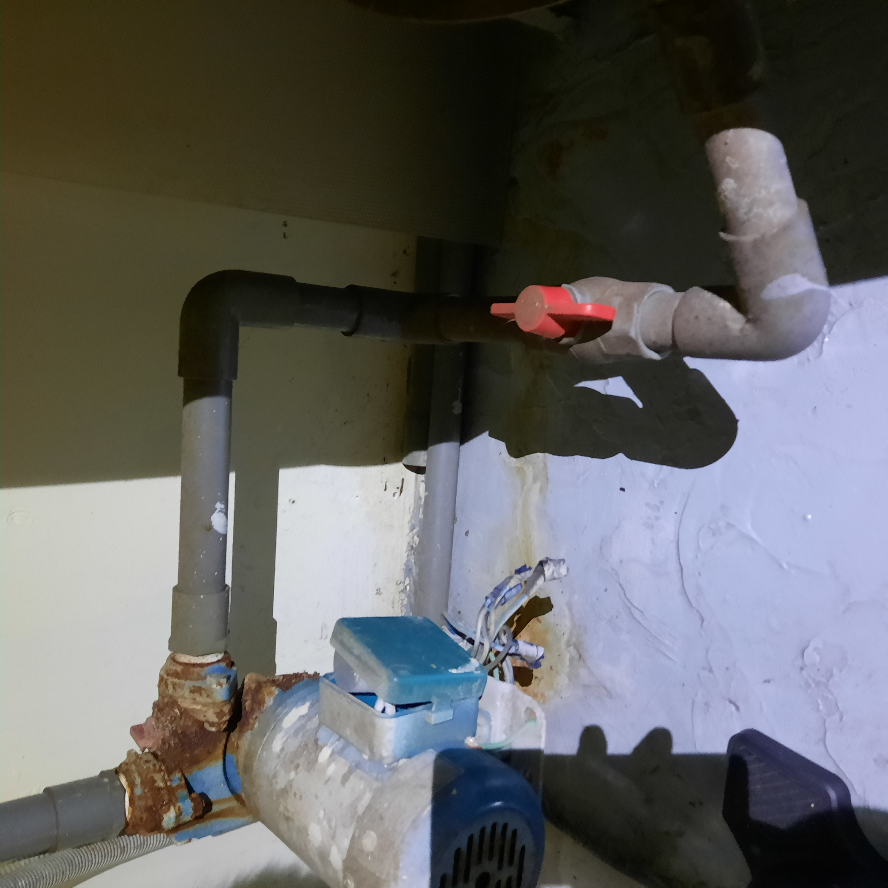

# 水塔

## 整體架構

|            說明            |       閥門       |
| :------------------------: | :--------------: |
| 自來水公司進水至地下室水塔 |  |
|     馬達抽水至頂樓水塔     |  |
|  頂樓水塔供給家用水與排水  |                  |

### 頂樓水塔

|                    說明                    |       圖示       |
| :----------------------------------------: | :--------------: |
|              利用軌道滑開入口              |  |
| 左管線為排水口； 另一邊為家用水供給口 |  |
|        水位降低，利用重量感應來抽水        |  |

## 問題處理

- 自來水供水水質異常： 關自來水進水閥門。
- 地下室水塔遭汙染： 關抽水馬達閥門，防止抽水至頂樓水塔（只剩頂樓有乾淨水）。

## 洗水塔

有鐵皮加蓋，不太會長青苔，約一年洗一次。可以從地下室水塔淤積情況來推測頂樓水塔有沒有抽到泥沙。

- 關自來水進水閥門。
- 頂樓感測器先拿出來防止馬達抽水。
- 頂樓排低水位，再抽水用刷子清淤。
- 

    頂樓抽水時，地下室維持低水位，攪拌泥沙，把髒水抽到頂樓排放。

    

    地下水水位維持在抽水口以上，不要讓馬達抽到空氣。

    

  

